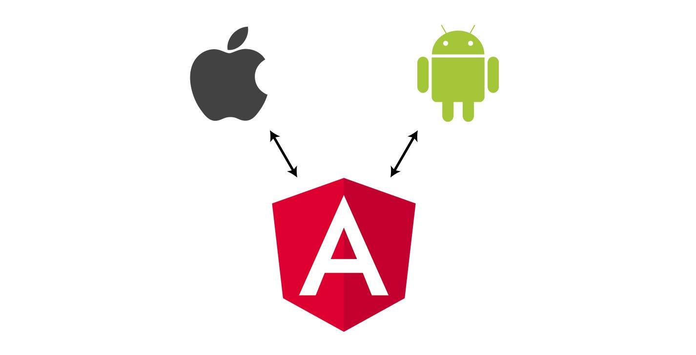

วันหนึ่งฉันเดินเข้าป่า ฉันเจอบัคตัวหนึ่ง มันถามฉันว่าแก้เมื่อไหร่ ฉันจึงตอบ มึงไปให้ไกล 555+

เข้าเรื่องกันเถอะ วันหนึ่งเขียน Angular อยู่ดีๆ แล้วจำเป็นต้องให้ Angular ไป call function ใน Mobile App ก็เลยไปลองไปหาข้อมูลใน stackoverflow ได้ข้อสรุปว่า

เว็บกับแอปมี 2 วิธีหลักๆ ในการติดต่อกัน (อาจจะมีวิธีอื่นอีกแต่ยังหาไม่เจอแหะ -0-)

1.  ใช้ URL Scheme
2.  ใช้ JavascriptCore (iOS) / JavascriptInterface (Android)

จากที่ลองปรึกษากับพี่ๆในทีม ดูเหมือนว่า วิธีที่ 2 จะเป็นวิธีที่ค่อนข้างง่ายกว่า รวมถึงทั้ง Mobile App และ Web สามารถทำ two way communication เพื่อ call function หากันได้ (เผื่อในอนาคต Mobile App ต้องมาเรียก function ใน Web)

---

### How to do . . .

การที่ Web กับ Mobile App จะ communication กันได้ ทางฝั่ง App จำเป็นต้องไปสร้าง instance ตัวหนึ่งขึ้นมาก่อน โดยจะสมมุติให้

-   iOS สร้าง **_instance ชื่อ iOS_** (ใช้ JavascriptCore) -> [วิธีการสร้าง instance](http://blastar.biz/2017/02/06/how-to-use-jscontext-from-javascriptcore-to-create-two-way-communication-with-web-page/)
-   Android สร้าง **_instance ชื่อ Android_** (ใช้ JavascriptInterface) -> [วิธีการสร้าง instance](https://blog.nextzy.me/webview-javascriptinterface-f3a18be450f1)

จากนั้นทางฝั่ง Web จะต้องประกาศตัวแปรเอาไว้ด้วย (เพื่อเอาไว้อ้างอิงถึง instance)


ทีนี้ผมต้องการเช็คว่า Mobile App นี้ ถูกเข้าจาก iOS หรือ Android เพื่อไปเรียกใช้ instance ของแต่ละตัว


ทีนี้เราสามารถเรียก instance แยกกันได้แล้ว หลังจากนั้นผมสามารถเรียก function ใน Mobile App ได้ดังนี้


โดยถ้า เว็บถูกเข้าผ่าน iOS จะให้เรียก function calliOSFunction

```
iOS.calliOSFunction();
```

แต่ถ้า เว็บถูกเข้าผ่าน Android จะให้เรียก function callAndroidFunction

```
Android.callAndroidFunction();
```

โดยชื่อ function ทางฝั่ง Mobile App จะเป็นคนกำหนดชื่อเอาไว้ ดังนั้นเวลาเรียก ชื่อ function ของแต่ละ instance จะต้องตรงกับชื่อ ที่ทางฝั่ง Mobile App กำหนดเอาไว้ด้วย เสร็จแล้ววว โอ้เย ~

---

ปล1. ขอบคุณ [Ake Exorcist](https://medium.com/@akexorcist) สำหรับคำแนะนำและตัดรูปให้ 555+

ปล2. ถึงช่วงเวลาขายของ ตอนนี้ Nextzy เปิดรับ Dev อยู่นะจ้ะ แต่เธอไม่รู้บ้างเลย

[**Nextzy Technologies Co.,ltd. รับสมัครผู้ร่วมทีมจำนวนมาก จบใหม่และมีประสบการณ์ Mobile และ Web |…**  
_Nextzy Technologies Co.,ltd. รับสมัครทีม iOS, Android, Full Stack Web Developer, System Analyst และ Automated/Software…_www.blognone.com](https://www.blognone.com/node/64996 "https://www.blognone.com/node/64996")[](https://www.blognone.com/node/64996)

Source Code Example :

<Embed src="https://gist.github.com/rainstormza/6372890bb8840349f2f6ed7123291539.js" aspectRatio={0.357} caption="" />

References :

[**Call Android method from TypeScript**  
_Add a TypeScript definition for the JavaScriptInterface type that will be injected by Android. Then declare a variable…_stackoverflow.com](https://stackoverflow.com/questions/41220743/call-android-method-from-typescript "https://stackoverflow.com/questions/41220743/call-android-method-from-typescript")[](https://stackoverflow.com/questions/41220743/call-android-method-from-typescript)

[**How to Call Native Iphone/Android function from Javascript?**  
_I am using Web View both in Iphone and Android. In Android, I use create a variable to call native Andriod…_stackoverflow.com](https://stackoverflow.com/questions/14181976/how-to-call-native-iphone-android-function-from-javascript "https://stackoverflow.com/questions/14181976/how-to-call-native-iphone-android-function-from-javascript")[](https://stackoverflow.com/questions/14181976/how-to-call-native-iphone-android-function-from-javascript)

[**Detecting iOS / Android Operating system**  
_I've done some research, and this question has come up, but not in the way I intend. I'm building a page for a client…_stackoverflow.com](https://stackoverflow.com/questions/21741841/detecting-ios-android-operating-system "https://stackoverflow.com/questions/21741841/detecting-ios-android-operating-system")[](https://stackoverflow.com/questions/21741841/detecting-ios-android-operating-system)
