เนื่องจากได้มีโอกาสทำฟีเจอร์ที่ต้องไปใช้ Firebase Cloud Messaging ในการทำ Push Notification ไปยัง Mobile App ซึ่งผมก็เคยได้ยินเกี่ยวกับบริการนี้มาบ้าง แต่ยังไม่เคยลองใช้เองจริง ๆ พอมีโอกาสก็รีบคว้าไว้อย่างไว 🙂


---

### มารู้จัก Firebase Cloud Messaging กันก่อน

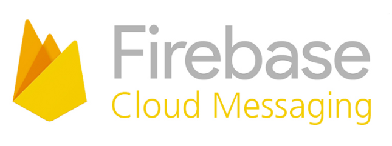

Firebase Cloud Messaging มันคือบริการส่งข้อความแจ้งเตือนไปยังแต่ละแพลตฟอร์ม (ได้ทั้ง iOS, Android และ Web) โดย Google เปิดให้เราสามารถใช้งานได้แบบไม่เสียค่าใช้จ่ายเลยด้วย

### สิ่งที่ต้องมี

-   nodejs
-   nodemon
-   axios
-   firebase-admin
-   googleapis
-   Firebase Project
-   ความเข้าใจใน HTML และ JavaScript

### ลองทดสอบทำ Push Notification กับ Web Browser

ก่อนอื่นก็ต้องสร้างโฟลเดอร์และไฟล์ที่จำเป็นต้องใช้กันก่อน

```
$ mkdir firebase-cloud-messaging && cd firebase-cloud-messaging
$ npm init -y && touch index.js
```

จะได้ไฟล์ `index.js` และ `package.json` มาอยู่ในโฟลเดอร์ของเรา แล้วแก้ไข Scripts ใน `package.json` ดังนี้

```
"scripts": {
  "start": "nodemon index.js"
},
```

(ใครยังไม่มี nodemon ให้ติดตั้งผ่าน `npm install -g nodemon` ก่อนนะ เพราะเวลาแก้ไขไฟล์ใน `index.js` เจ้า nodemon จะคอยสั่งรันใหม่ให้เราเอง)

หลังจากนั้นให้ลง Package ชื่อ firebase-admin

```
$ npm install firebase-admin --save
```

อย่าเผลอไปใช้ Firebase ธรรมดานะ เพราะมันเป็นของ Client มันไม่มี Method ที่ชื่อว่า `messaging()` (ตอนแรกไปลองของ firebase ธรรมดา ใช้ `firebase.messaging()` แล้วเด้ง Error แดงเถือกมาเลย 55+)

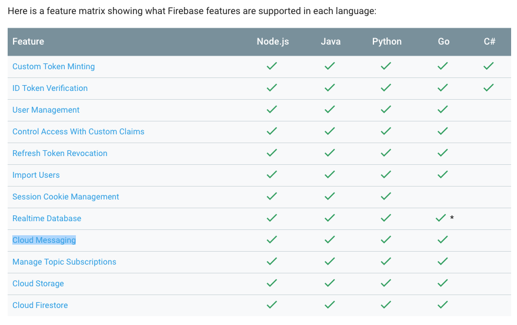

สร้าง Firebase Project โดยไปที่แล้วเพิ่ม Project ใหม่

[**Sign in - Google Accounts**  
_Edit description_console.firebase.google.com](https://console.firebase.google.com/ "https://console.firebase.google.com/")[](https://console.firebase.google.com/)

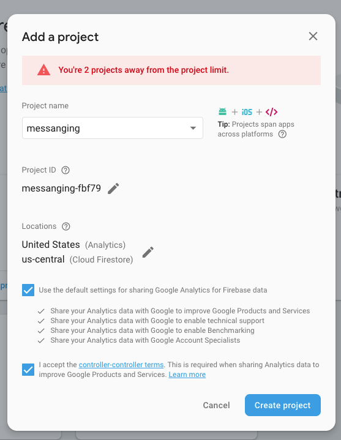

เมื่อสร้าง Project เสร็จแล้ว ก็ให้ไปที่ Project Settings → Cloud Messaging

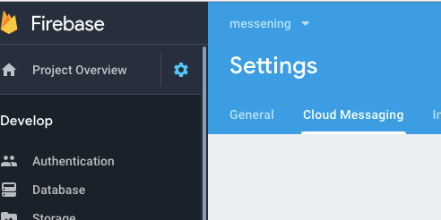

เลื่อนลงมาข้างล่างจะเห็น Web Push certificates ให้เรา Create Key เอาไว้ (เดี๋ยวจะใช้ตอน Deploy Web ขึ้น Hosting)


จะได้หน้าตา Key ดังรูปข้างล่าง

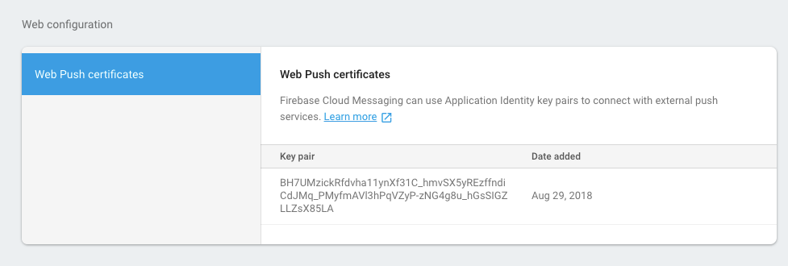

ไปที่ [https://github.com/firebase/quickstart-js](https://github.com/firebase/quickstart-js) แล้วทำการ Clone Project มา ในโฟลเดอร์ `quickstart-js` จะมีโฟลเดอร์ที่ชื่อว่า `messaging` อยู่ ให้เราทำการแก้ไขไฟล์ index.html โดยใส่ Key ที่เรา Create จาก Web Push certificates เพิ่มเข้าไป

```
messaging.usePublicVapidKey('<YOUR_PUBLIC_VAPID_KEY_HERE>');
```

จากนั้นให้ไป Copy ค่า projectId มา จาก Project Setup (ของแต่ละคนไม่เหมือนกันนะ)

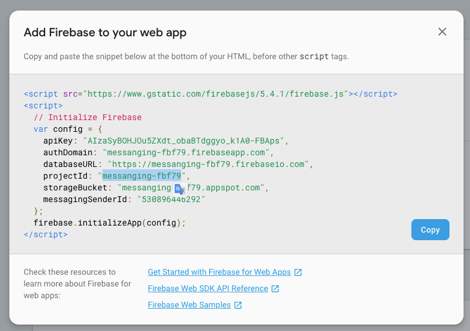

ติดตั้ง firebase-tools ใช้สำหรับ Deploy Web ขึ้น Hosting ของ Firebase

```
$ npm install -g firebase-tools
```

จากนั้นใช้คำสั่ง `cd` เข้าไปที่โฟลเดอร์ `messaging` แล้ว Deploy ผ่าน Command Line `firebase deploy` และตามด้วย projectId ที่เรา Copy เอาไว้ก่อนหน้านี้

```
$ firebase deploy --project messanging-fbf79
```

เพิ่มเติม — ขั้นตอนนี้ อาจจะมีการ Authen Firebase ก่อน สำหรับคนที่ Deploy ครั้งแรก

หาก Deploy สำเร็จจะขึ้นดังรูปข้างล่าง พร้อมกับ URL ให้เราเข้าไปเช็คได้

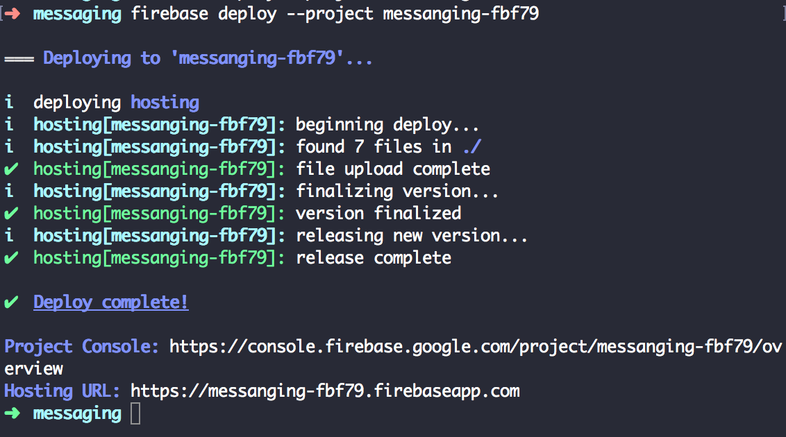

เมื่อเข้าไปที่ [https://messanging-fbf79.firebaseapp.com/](https://messanging-fbf79.firebaseapp.com/) จะเห็นหน้าตาเว็บไซต์ดังนี้

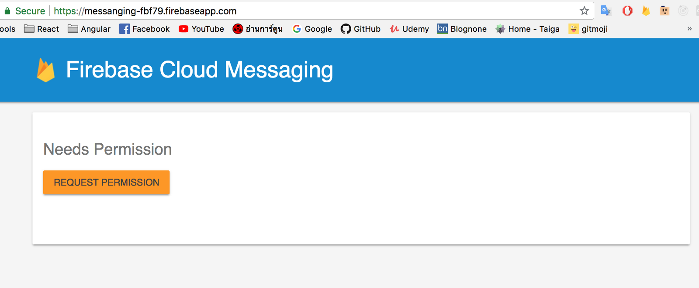

เมื่อกดปุ่ม REQUEST PERMISSION ก็จะทำการยิง API เพื่อไปขอ Token มา จากนั้นจะมีหน้าให้กด Allow เพื่อเปิด Notification ของ Browser (ต้องกด Allow นะ ถ้ากด Block Notification จะไม่ขึ้นเลย)

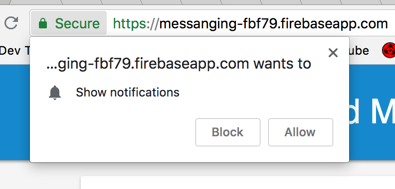

รอสักครู่ก็จะได้ Token มาดังนี้

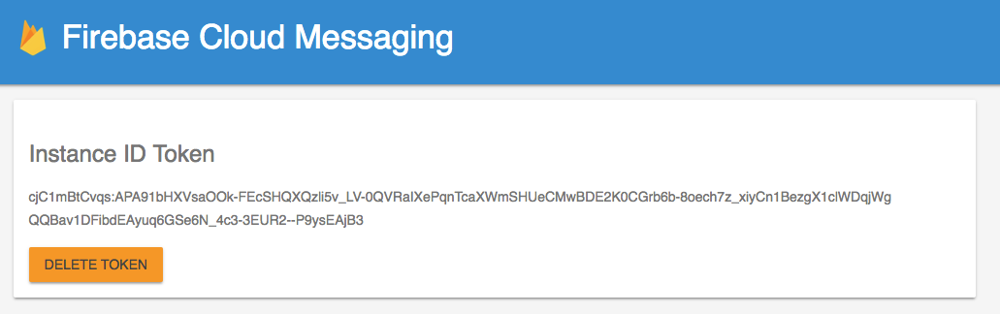

ซึ่ง Token นี้จะระบุตัวตนของเครื่องนั้นๆ เอาไว้สำหรับระบุเครื่องที่ต้องการจะ Push Notification ไปหาจาก ทางฝั่ง Server

### ทดสอบทำ Push Notification กับ Node.js

ถึงเวลาทดสอบทำ Push Notification ไปยัง Website ของเราแล้ว เย้ !! ก่อนอื่นเราต้องไปขอ Admin SDK configuration ก่อน ซึ่งต้องไปที่ Project Settings → Service accounts

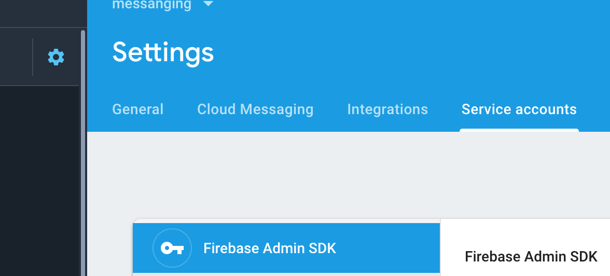

เลื่อนลงมาข้างล่างจะเห็นปุ่ม Generate new private key ซึ่งเมื่อกดแล้วจะได้ไฟล์ .json มา

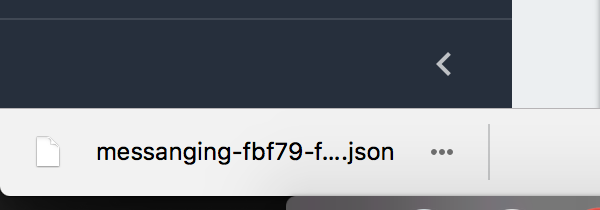

ให้ Copy ไปวางในโฟลเดอร์ `firebase-cloud-messaging` ที่เราสร้างไว้ตั้งแต่ตอนแรก จะได้ Project Structure ประมาณนี้

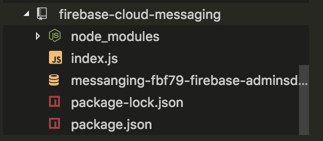

หลังจากนั้นให้ติดตั้ง Package เพิ่มเติมดังนี้

```
$ npm install googleapis axios --save
```

ให้เพิ่ม Script ลงในไฟล์ `index.js` ตามโค้ดข้างล่างนี้

<Embed src="https://gist.github.com/rainstormza/0f0f18b10fa58508ae3de72acd3a8e40.js" aspectRatio={0.357} caption="" />

โดยตัวแปรพวกนี้ จะต้องเปลี่ยนเป็นของตัวเองนะ เพราะแต่ละคนจะไม่เหมือนกัน

```
const serviceAccount = require('./messanging-fbf79-firebase-adminsdk-kag1v-664f36ff55.json')

const databaseURL = 'https://messanging-fbf79.firebaseio.com'

const URL = 'https://fcm.googleapis.com/v1/projects/messanging-fbf79/messages:send'

const deviceToken = 'cjC1mBtCvqs:APA91bHXVsaOOk-FEcSHQXQzli5v_LV-0QVRaIXePqnTcaXWmSHUeCMwBDE2K0CGrb6b-8oech7z_xiyCn1BezgX1clWDqjWgQQBav1DFibdEAyuq6GSe6N_4c3-3EUR2--P9ysEAjB3'
```

-   `serviceAccount` เป็นไฟล์ .json ที่ได้มากจากตอน Generate new private key
-   `databaseURL` ได้มาจาก project setup
-   `URL` คือ url ที่เราต้องการยิงไปหา Google เพื่อให้lj’ Push Notification ให้เรา โดยหลัง `/projects/` คือ `projectId` ของเรา
-   `deviceToken` คือ Token จาก Website ที่เรา Deploy ขึ้นไป

หลังจากนั้นให้รันไฟล์ `index.js`

```
$ npm start
```

ก็จะเห็นว่ามี Push Notification ขึ้นมาทางมุมขวา (ถ้าใครไม่เห็นให้ลองเปลี่ยน Tab ใน Chrome ไปที่ Tab อื่นก่อนนะ)

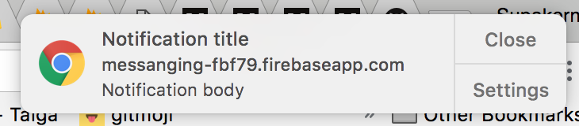

ซึ่งตัว Website ก็จะสามารถรับค่าต่างๆ ผ่านทาง Push Notification ได้

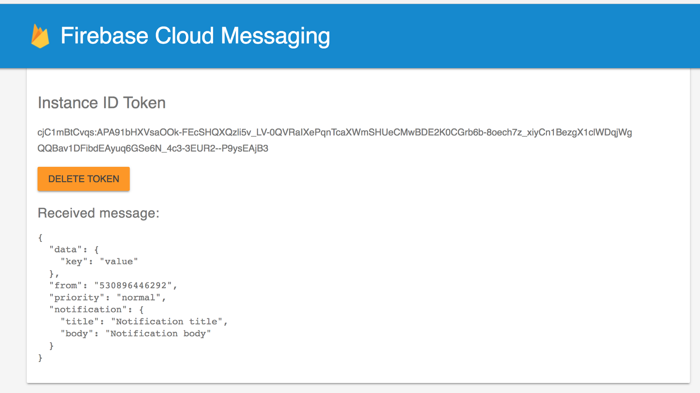

### ลองส่ง Push Notification ไปหา Mobile App ดูบ้าง

การทำ Push Notification ไปหา Mobile App ก็ง่ายมากๆ โดยในฝั่ง Node.js ก็แค่เปลี่ยน ตัวแปร `deviceToken` ให้เป็น Token ของ Mobile App ในเครื่องนั้นๆ แล้วลองยิงไป จะได้ผลลัพธ์ดังนี้

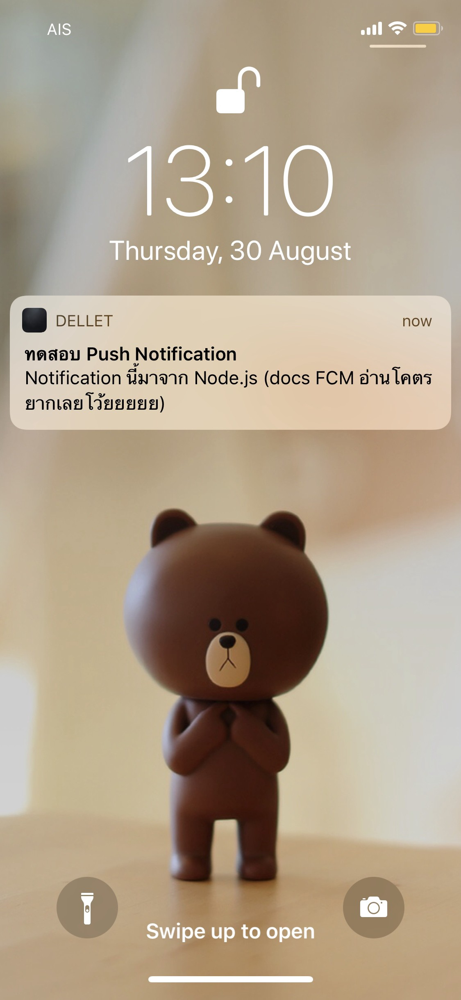

สามารถลองทดสอบ Push Notification ไปหา Mobile App ผ่าน Firebase Console ได้ด้วยนะ โดยไปที่ Grow → Cloud Massaging

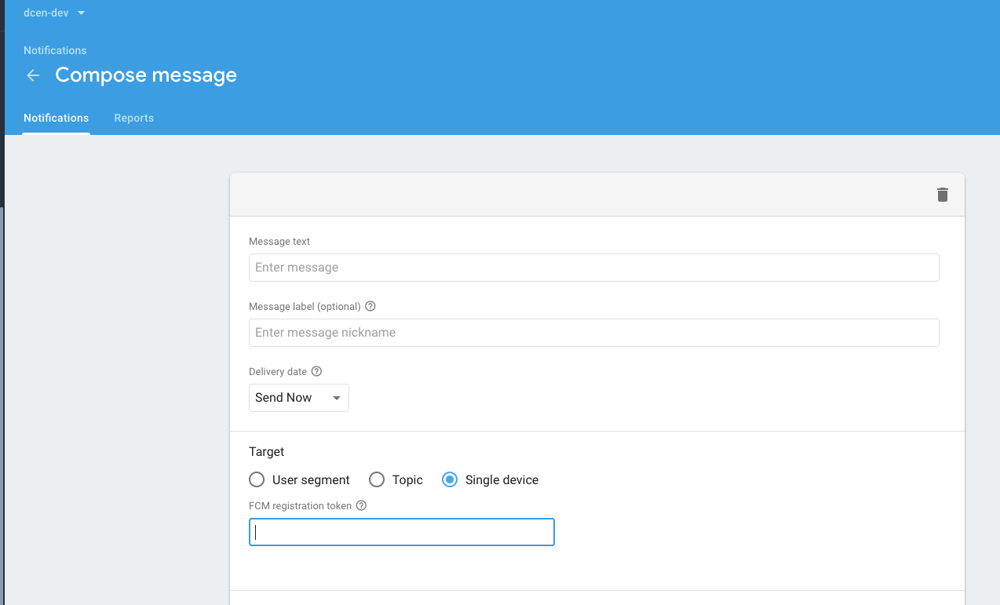

ในฝั่ง iOS และ Android ต้อง Handle ยังไง คงต้องรอ [Thongpak Pongsilathong](https://medium.com/@thongpak21) กับ [The Khaeng 🍭 (เดอะแข็ง)](https://medium.com/@Nonthawit) เป็นคนเขียนแล้วละ 555+

### สำหรับฝั่งที่เป็น Client ก็ต้อง Handle Method พวกนี้เอาไว้ด้วย

ถ้าดูจากในไฟล์ `index.html` จะเห็นว่ามี `onMessage()` อยู่ด้วยเพื่อดักรับ Push Notification ที่ส่งเข้ามา

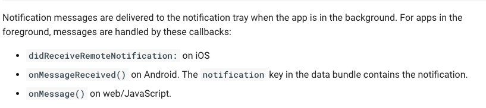

### สรุป

-   จะเห็นว่าการทำ Push Notification นั้นไม่ยากเลย แต่สิ่งที่ยากคือ การหาอ่าน Docs ซึ่งส่วนตัวผมมองว่า Docs ตัวอย่าง มันอยู่หลายที่มากและงมอยู่นานพอสมควร กว่าจะออกมาเป็นรูปเป็นร่าง
-   Docs ของ Cloud Messaging บางอันก็ไม่มีการอัพเดทตาม Version ล่าสุด
-   API ในการทดสอบ Cloud Messaging มีหลายแบบมาก ทั้ง HTTP v1, Legacy Protocol ซึ่งแต่ละอัน ส่ง Params ไปไม่เหมือนกัน
-   ในส่วนของ Message Body ที่เราส่งไปใน Push Notification มีอะไรให้เล่นอีกมาก เช่น Action, Events และตัวแปรอื่นๆ
-   ในการให้ Node.js ยิงไปหา Mobile App สามารถทำได้แค่เปลี่ยนตัวแปร `deviceToken`
-   การเอา FCM ไปใช้กับ Socket.io แล้วให้ยิง Data ที่ต้องการออกมา ก็เป็นอีกอย่างที่น่าสนใจ

### Source code + Demo

[**rainstormza/firebase-cloud-messaging**  
_Contribute to rainstormza/firebase-cloud-messaging development by creating an account on GitHub._github.com](https://github.com/rainstormza/firebase-cloud-messaging "https://github.com/rainstormza/firebase-cloud-messaging")[](https://github.com/rainstormza/firebase-cloud-messaging)

[**Firebase Cloud Messaging Example**  
_Edit description_messanging-fbf79.firebaseapp.com](https://messanging-fbf79.firebaseapp.com/ "https://messanging-fbf79.firebaseapp.com/")[](https://messanging-fbf79.firebaseapp.com/)

### References

[**Firebase Cloud Messaging with Android**  
_There are quite a number of steps, it is probably too long to post here, but since you just asked for guidance, I'll…_stackoverflow.com](https://stackoverflow.com/questions/47271268/firebase-cloud-messaging-with-android "https://stackoverflow.com/questions/47271268/firebase-cloud-messaging-with-android")[](https://stackoverflow.com/questions/47271268/firebase-cloud-messaging-with-android)

[**firebase/quickstart-js**  
_Firebase Quickstart Samples for Web. Contribute to firebase/quickstart-js development by creating an account on GitHub._github.com](https://github.com/firebase/quickstart-js/tree/master/messaging "https://github.com/firebase/quickstart-js/tree/master/messaging")[](https://github.com/firebase/quickstart-js/tree/master/messaging)

[**firebase/quickstart-nodejs**  
_Contribute to firebase/quickstart-nodejs development by creating an account on GitHub._github.com](https://github.com/firebase/quickstart-nodejs/blob/839d3049ef79eded86e630a902b404f49df15d6d/messaging/index.js#L22-L40 "https://github.com/firebase/quickstart-nodejs/blob/839d3049ef79eded86e630a902b404f49df15d6d/messaging/index.js#L22-L40")[](https://github.com/firebase/quickstart-nodejs/blob/839d3049ef79eded86e630a902b404f49df15d6d/messaging/index.js#L22-L40)

[**Authorize Send Requests | Firebase**  
_To authenticate the service account and authorize it to access Firebase services, you must generate a private key file…_firebase.google.com](https://firebase.google.com/docs/cloud-messaging/auth-server "https://firebase.google.com/docs/cloud-messaging/auth-server")[](https://firebase.google.com/docs/cloud-messaging/auth-server)

[**Send Messages | Firebase**  
_Based on the publish/subscribe model, FCM topic messaging allows you to send a message to multiple devices that have…_firebase.google.com](https://firebase.google.com/docs/cloud-messaging/admin/send-messages "https://firebase.google.com/docs/cloud-messaging/admin/send-messages")[](https://firebase.google.com/docs/cloud-messaging/admin/send-messages)

[**About FCM Messages | Firebase**  
_FCM allows multiple parties to send messages to the same client app. For example, suppose the client app is an article…_firebase.google.com](https://firebase.google.com/docs/cloud-messaging/concept-options "https://firebase.google.com/docs/cloud-messaging/concept-options")[](https://firebase.google.com/docs/cloud-messaging/concept-options)

[**วิธีสร้าง Cloud Messaging ด้วย Firebase APIs และ Deploy ขึ้น Firebase Hosting**  
_วิธีสร้าง Cloud Messaging ด้วย Firebase API และ Deploy ขึ้น Firebase Hosting_medium.com](https://medium.com/@goangle/fcm-cloud-messaging-%E0%B8%94%E0%B9%89%E0%B8%A7%E0%B8%A2-firebase-99e473ae41f6 "https://medium.com/@goangle/fcm-cloud-messaging-%E0%B8%94%E0%B9%89%E0%B8%A7%E0%B8%A2-firebase-99e473ae41f6")[](https://medium.com/@goangle/fcm-cloud-messaging-%E0%B8%94%E0%B9%89%E0%B8%A7%E0%B8%A2-firebase-99e473ae41f6)

[**รู้จัก Firebase Cloud Messaging (FCM) ตั้งแต่ Zero จนเป็น Hero**  
_จากที่ผมได้มีโอกาสไปแชร์เนื้อหา Firebase Cloud Messaging ในงาน Google I/O 2016 Extended Bangkok ที่ผ่านมา…_medium.com](https://medium.com/@jirawatee/%E0%B8%A3%E0%B8%B9%E0%B9%89%E0%B8%88%E0%B8%B1%E0%B8%81-firebase-cloud-messaging-fcm-%E0%B8%95%E0%B8%B1%E0%B9%89%E0%B8%87%E0%B9%81%E0%B8%95%E0%B9%88-zero-%E0%B8%88%E0%B8%99%E0%B9%80%E0%B8%9B%E0%B9%87%E0%B8%99-hero-fb7900af92cd "https://medium.com/@jirawatee/%E0%B8%A3%E0%B8%B9%E0%B9%89%E0%B8%88%E0%B8%B1%E0%B8%81-firebase-cloud-messaging-fcm-%E0%B8%95%E0%B8%B1%E0%B9%89%E0%B8%87%E0%B9%81%E0%B8%95%E0%B9%88-zero-%E0%B8%88%E0%B8%99%E0%B9%80%E0%B8%9B%E0%B9%87%E0%B8%99-hero-fb7900af92cd")[](https://medium.com/@jirawatee/%E0%B8%A3%E0%B8%B9%E0%B9%89%E0%B8%88%E0%B8%B1%E0%B8%81-firebase-cloud-messaging-fcm-%E0%B8%95%E0%B8%B1%E0%B9%89%E0%B8%87%E0%B9%81%E0%B8%95%E0%B9%88-zero-%E0%B8%88%E0%B8%99%E0%B9%80%E0%B8%9B%E0%B9%87%E0%B8%99-hero-fb7900af92cd)
