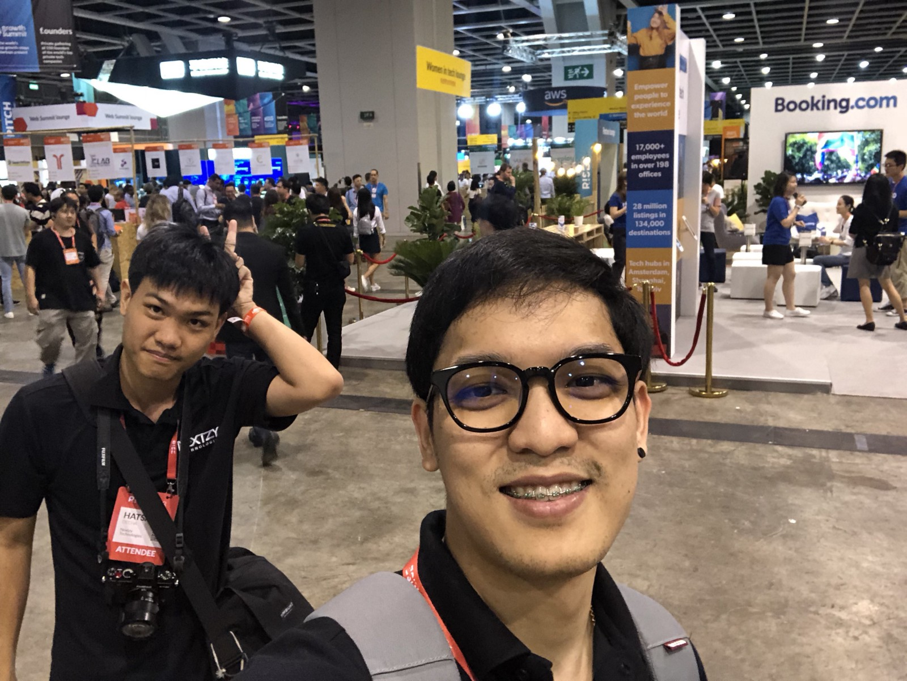

### RISE Conf คือ ?

มันคือ งานสัมนาที่รวมเอาคนดังจากบริษัทใหญ่ๆ และ start up ที่น่าสนใจ เพื่อมาบอกเล่าเรื่องราวและประสบการณ์เกี่ยวกับ product ของตัวเอง ขึ้นมาพูดบน stage ที่ประเทศฮ่องกง ซึ่งก็จะมีบริษัทใหญ่ๆที่จะส่งคนมาเป็น speaker ในงาน ยกตัวอย่าง เช่น Microsoft, LINE Corporation, Amazon และบริษัทอื่นๆ อีกมากมาย

นอกจากนี้ภายในงานยังมีการ PITCH แข่งกันเพื่อนำเสนอ product ของตัวเองให้กับ Investor ที่เข้ามาดูงานอีกด้วย

---

### อยากมางานต้องเตรียมตัวอะไรบ้าง ?

-   อยากแรกเลยคือ ต้องมี **เงิน** ก่อน
-   **pocket money** แลกไว้ใช้จ่ายฮ่องกง (แลกที่ superrich เรตก็โอเคนะ)
-   **passport** สำหรับเข้าฮ่องกง (ไม่ต้องใช้ visa นะจ้ะะะะ เย่ !!)
-   ตั๋วเข้างาน RISE Conf (จองได้จากเว็บหลักเลย [https://riseconf.com/](https://riseconf.com/)) (จองเสร็จแล้วเค้าจะส่งตั๋วมาให้ทาง email ในเมล์จะมี email กับ ref id ไว้ใช้ในการ login เข้าแอป RISE ซึ่งในแอปเราจะได้ QR Code มา เพื่อนำไปใช้แลกป้ายกับริชแบนไว้ใช้ในการเข้างานในวันจริง)
-   ตั๋วเครื่องบิน + สถานที่พัก (จองจาก [www.expedia.com](http://www.expedia.com) ก็สะดวกดีนะ ได้ตั๋วเครื่องบิน + ที่พักพร้อมกันเลย)
-   หาสถานที่เที่ยวในฮ่องกงไว้ล่วงหน้า (หรือจะมาหาเอาตอนถึงแล้วเหมือนผมก็ได้นะ) เช่น วัด, ย่านช้อปปิ้ง, ผับ รวมไปถึงเส้นทางการนั่งรถไฟใต้ดิน
-   Sim2Fly ไว้ใช้เน็ตในฮ่องกง (ซื้อได้ที่ AIS Shop)
-   ช้อน + ส้อม ประเทศนี้แม่ง ซื้อข้าวใน 7–11 ไม่มีอะไรให้เลย ฟรัคคคคค
-   เตรียมมือถือด้วยนะ อย่าลืมเอามือถือไปแบบ [Hatsanai Decha](https://medium.com/@hatsanaidecha) นะ

ปล. สำหรับตั๋วเครื่องบิน + สถานที่พัก + ตั๋วเข้างาน RISE Conf [Palakorn Nakphong](https://medium.com/@codingz) และ [Napakkhamon Thammananthakul](https://medium.com/@napakkhamont) จัดการค่าใช้จ่ายและทำการจองให้ทั้งหมด ขอขอบคุณจากเลยใจฮับพี่ๆ

---

### มารู้จักประเทศฮ่องกงกันก่อน

ประเทศฮ่องกง จะประกอบไปด้วย 3 ส่วนก็คือ **เกาลูน** (กรอบสีแดง), **เกาะฮ่องกง** (กรอบสีน้ำเงิน) และ [**เขตดินแดนใหม่**](https://th.wikipedia.org/w/index.php?title=%E0%B9%80%E0%B8%82%E0%B8%95%E0%B8%94%E0%B8%B4%E0%B8%99%E0%B9%81%E0%B8%94%E0%B8%99%E0%B9%83%E0%B8%AB%E0%B8%A1%E0%B9%88&action=edit&redlink=1 "เขตดินแดนใหม่ (ไม่มีหน้า)") (พื้นที่ที่เหลือทั้งหมดของประเทศฮ่องกง รวมไปถึงกรอบสีดำ) ซึ่งสนามบินของฮ่องกงจะอยู่ในเขตดินแดนใหม่

---

### บินลัดฟ้าสู่ประเทศฮ่องกงกับ Hongkong Airlines

ในการบินไปประเทศฮ่องกง มีสารการบินให้เลือกใช้มากมาย ไม่ว่าจะเป็น Hongkong Airlines, Emirates บลาๆ แต่ในเมื่อเราไปประเทศฮ่องกง เราควรจะเลือกใช้สายการบินของประเทศเค้าสิ ซึ่งมีราคาถูกและมีเที่ยวบินมากกว่าสายการบินอื่นๆ (ส่วนตัวอยากบินกับ Emirates เพราะเห็นเค้าบอกว่าแอร์น่ารักมากกกก)

บนสายการบินที่นั่งค่อนข้างกว้าง (กว้างกว่าสายการบินสีแดงของไทยเยอะเลย) รวมถึงมีหนังให้ดู มีเพลงให้ฟัง และมีข้าวให้อีก 1 มื้อ ยอดเยี่ยมไปเลย

ใช้เวลาในการบินประมาณ 2 ชั่วโมงนิดๆจากประเทศไทยถึงประเทศฮ่องกง เมื่อเราได้กระเป๋าแล้วเดินออกไปจากที่รับกระเป๋า จะสังเกตว่ามีคนมารอต้อนรับเราอย่างอบอุ่น (เป็นประเทศที่คนใจดีมากๆ)

เมื่อถึงสนามบินแล้วสิ่งแรกที่เราควรทำเลยก็คือซื้อบัตร Octopus Card (ซื้อได้ที่ train ticket center จะมีอยู่หลายจุดในตัวอาคารสนามบิน) สำหรับบัตรนี้ เราสามารถเติมเงินเข้าไปใช้แทน ค่ารถไฟ ค่ารถราง ค่าเรือ ค่าอาหาร ค่าน้ำ ค่านุ่น ค่านี่ ได้หลายประเภทมาก (ทำไมถึงต้องมีบัตร? เพราะ การนั่งรถในประเทศฮ่องกงมันต้องจ่ายแบบพอดี จ่ายเกินไปมันไม่ทอน เลยต้องมีบัตรเอาไว้) ซึ่งค่าบัตรจะราคา 150 HKD จะมีเงินในบัตร 100 HKD และค่ามัดจำ 50 HKD ซึ่งตอนเรากลับประเทศสามารถแลกบัตรเงินเพื่อเอาค่ามัดจำได้ (สามารถเติมเงินเพิ่มเข้าไปในบัตรได้)

---

### จากสนามบินฮ่องกงเข้าตัวเมือง

การเดินทางเข้าตัวเมืองมีหลายวิธีมาก เช่น Airport Express (ราคาค่อนข้างสูง 100 HKD), City Bus (ถูกมากเป็นวิธีที่ถูกที่สุดแล้ว ประมาณ 20–40 HKD ขึ้นอยู่กับสถานที่ปลายทาง), Taxi (แพงโคตรๆ แถมยังคิดค่ากระเป๋าแยกอีก ราคาอยู่ที่ประมาณ 220 HKD)

สุดท้ายเราก็เลยเลือกแบบ City Bus โดยเราสามารถดูว่าเราต้องขึ้นรถบัสหมายเลขไหนได้จาก Google Map โดยตั้งไปที่พักของเราแล้วเลือกประเภทการเดินทางแบบ Bus (ที่พักที่จองไว้อยู่ในส่วนของ เกาะฮ่องกง)

จากรูปข้างบน google map บอกว่าเราสามารถไปได้ทั้งสาย A11 และ E11 ซึ่งผมลองเช็คราคาจาก [https://www.hongkongairport.com/en/transport/to-from-airport/public-buses.page#content2](https://www.hongkongairport.com/en/transport/to-from-airport/public-buses.page#content2) แล้วพบว่าสาย A11 ราคาอยู่ที่ 48 HKD และ สาย E11 อยู่ที่ 21 HKD ก็เลยเลือกใช้บริการของสาย E11 ซึ่งถึงจุดหมายปลายทางเหมือนกัน

เมื่อเราได้สายรถบัสที่ต้องการจะขึ้นแล้ว ก็ออกจากอาคารสนามบินมาข้างนอก จะมีป้ายบอกทาง To city อยู่ให้เดินตามป้ายไปเรื่อยๆ ข้างนอกจะมีป้ายรอรถบัสหลายๆสาย ให้เข้าไปต่อแถวสายที่เราต้องการจะขึ้น รอประมาณ 5–15 นาที จะมีรถมาเรื่อยๆ

โดยรถบัสที่เรานั่งจะมีทั้งหมดสองชั้น แนะนำให้นั่งชั้นบนเพื่อดูวิวระหว่างการเดินทาง การเดินทางเข้าเมืองจะใช้เวลาประมาณ 1 ชั่วโมง (ขึ้นอยู่กับว่ารถติดด้วยมั้ยนะ) ซึ่งรถบัสลุงแกขับเหวี่ยงมาก ใครเมารถ เตรียมใจไปนิดนึง 555 (เหวี่ยงเฉพาะช่วงออกจากสนามบินนะ พอขึ้นทางด่วน เข้าตัวเมืองแล้วขับปกติ ไม่รู้เพราะอะไรเหมือนกัน)

---

### ฮ่องกงมีรถรางด้วยนะเออ

ประเทศฮ่องกงมีรถรางให้เรานั่งด้วยนะ โดยจะเป็นรถที่เอาไว้ใช้นั่งชมวิวรอบๆ เมือง หรือใช้สำหรับเดินทางก็ได้ รถรางบ้านเค้าก็อยู่บนถนนเดียวกับรถยนต์นี่แหละ ราคานั่งตลอดสายประมาณ 2.6 HKD (ใช้ octopus card จ่ายได้ด้วยนะ)

โดยรถข้างจะขึ้นที่ประตูหลัง และจ่ายตังและออกจากรถที่ประตูหน้า

ปล. รถรางมีให้บริการเฉพาะ เกาะฮ่องกง เท่านั้นนะ

---

### เช็คอินโรงแรมที่จองเอาไว้

หลังจากลงรถจากป้ายรถบัสเดินอีกประมาณ 350 เมตรก็ถึงโรงแรมแล้ว การเช็คอินโรงแรมใช้แค่ ref no ที่เราได้จากการจองผ่าน expedia + passport ของผู้ที่เข้าพักทั้งหมด ก็สามารถเช็คอินได้แล้ว

ภายในห้องของโรงแรมมีความ minimal มากๆ เป็นห้องที่มีขนาดเล็ก แต่ให้ความรู้สึกว่าห้องไม่ได้เล็กเลย

---

### น้ำดื่มในประเทศฮ่องกง

น้ำดื่นในประเทศฮ่องกงมีรูปร่างแปลกๆ แบบไม่เคยเห็นที่ไหนมาก่อน ก็เลยถ่ายรูปเก็บเอาไว้เป็นที่ระทึก

---

### Pre-Registration RISE Conference

วันแรกของงานจะเปิดให้คนเข้าไปลงทะเบียนเพื่อรับป้ายและริชแบนได้ก่อนวันงานเริ่ม (คิดว่าคนน่าจะเยอะมากเลยเปิดให้ pre-register ได้ก่อน 1 วัน) สิ่งที่ต้องเตรียมไปก็คือ QR Code ที่อยู่ในแอป RISE Conf เพื่อนำไปสแกนแลกป้ายและริชแบน

สำหรับงาน RISE Conf จะจัดที่ [Hong Kong Convention and Exhibition Centre](https://en.wikipedia.org/wiki/Hong_Kong_Convention_and_Exhibition_Centre) ซึ่งเป็นตึกที่ใช้จัดงานสัมนาต่างๆ มากมาย ซึ่งข้างบนตึกก็มีวิวที่มองลงมาเห็นถนนและทะเลของฮ่องกง

---

### Mongkok ย่านที่มีรองเท้าขายเยอะที่สุด

Mongkok เป็นสถานที่ท่องเที่ยวที่พลาดไม่ได้เลย เมื่อคุณมาประเทศฮ่องกง มันเป็นย่านช้อปปิ้งที่มีของเยอะมากๆ มีทั้งของกินที่หลากหลาย ศูนย์การค้าหลายแห่ง ร้านรองเท้า adidas, nike มีหลายร้านมากๆ ที่สำคัญมี LINE Friends Store ด้วยนะ (ซึ่งจะอยู่ในห้าง Langham Place)

สามารถนั่ง mtr ไปลงได้ที่สถานี Mongkok Station

คนส่วนใหญ่ที่มาฮ่องกงก็มาเที่ยวมงก๊กกัน รวมไปถึงคนฮ่องกงเองก็ชอบมาเดินย่านนี้ด้วย มีวัยรุ่นมาเดินช้อปปิ้งกันเยอะมาก

ในมงก๊กยังมีร้านชานมไข่มุกที่ขึ้นชื่ออย่าง KOI ด้วยนะ แถวยาวไปถึง KOI ที่ประเทศไทยเลยทีเดียว

---

### 1st Day of RISE Conf

เข้ามาภายในงานวันแรก ก็จะเห็นป้าย RISE ตั้งเอาไว้ให้คนที่มาเข้าง่ายถ่ายรูปเช็คอินกันก่อน อิอิ

ภายในงานจะมีหลาย Stage มาก ซึ่งแต่ละ Stage อาจจะมีการขึ้นพูดในเวลาที่พร้อมกัน ดังนั้นเราควรทำการวางแผนเพื่อเลือก session ที่เราต้องการจะไปฟังให้ดีๆ โดยอาจจะเลือกจาก หัวข้อที่เราสนใจ หรือหัวข้อที่มีคนดังๆมาพูด ฮ่าๆ

ในงานนั้นส่วนของ Centre Stage จะจุคนได้เยอะที่สุด เพราะคิดว่าแต่ละหัวข้อที่ขึ้นมาพูด เป็นหัวข้อที่น่าสนใจซะส่วนใหญ่

---

### Grab บอกว่าตัวเองจะไม่ได้ทำแค่ Transport อีกต่อไป

Co-Founder ของ Grab ขึ้นมาพูดเกี่ยวกับอนาคตของบริษัท โดยบอกว่า Grab จะไม่ใช่แค่แอปอีกต่อไป แต่จะเป็น Grab Platform โดยจะมีการให้บริการทั้ง Transport, Food Delivery, Payment Solutions และ Logistic ซึ่งอาจจะรวมเอาบริการทั้งหมดนี้ไว้ในแอปเดียว เรียกว่า Super App

นอกจากนี้ Grab บอกว่าจะเปิดรับ Partner เข้ามาร่วมกันทำ Grab Platform ไปด้วยกัน และเน้นมากว่าจะลุยตลาด Southeast Asia ก่อนอันดับแรก

ส่วนตัวผมมองว่าเป็นเรื่องดีนะ เพราะในประเทศไทยมีผู้ใช้งาน Grab เป็นจำนวนมาก ในอนาคต ถ้า Grab ขยายตัวเองไปเป็น Platform ได้ เหล่า Developer ในประเทศไทยอาจจะเป็นที่ต้องการตัวในตลาดมากขึ้นด้วย

---

### Create and deploy a blockchain app with IBM Blockchain Platform

เค้าบอกว่าสำหรับใครที่อยากจะสร้าง App และต้องการความสามารถของ Blockchain ในเรื่องของความปลอดภัย สามารถสร้างได้ง่ายๆ เพียงแค่ไม่กี่คลิ๊ก ผ่าน IBM Blockchain Platform (แต่เสียตังนะ ไม่ฟรี -0-)

IBM ได้เริ่มศึกษาเกี่ยวกับ Blockchain มาตั้งแต่ปี 2015 — ปัจจุบัน ซึ่งปัจจุบัน (2018) ก็ได้ Update IBM Blockchain Platform ไปใช้ Fabric แล้ว

---

### LINE เริ่มนำ Blockchain มาใช้ในบริการต่างๆ ของตัวเองแล้ว (Token Economy)

CEO ขึ้นมาพูดเกี่ยวกับ strategy ในการนำ Blockchain เข้ามาเชื่อมต่อกับบริการต่างๆ ของ LINE โดย LINE จะสร้าง Token Economy ขึ้นมาซึ่ง Token นี้สามารถนำไปใช้กับบริการของ LINE ได้ในอนาคต และอาจจะมีการนำ Token ที่สร้างขึ้น ไปใช้กับ third-party อื่นๆได้ด้วย

มองว่าในอนาคต Grab กับ LINE อาจจะมีการแข่งขันกันอีกมากในอนาคต โดย Grab เกิดมากจากธุรกิจ Transport และพยายามทำตัวเองเป็น Platform ในส่วนของ LINE เกิดมาจากธุรกิจ Messenger และได้ทำตัวเองไปเป็น Platform เรียบร้อยแล้ว บวกกับตอนนี้ก็มี LINE Man แถมตอนนี้ยังมี Token Economy เข้ามาอีก มองภาพรวมๆแล้ว LINE นำ Grab ไปหลายก้าวเลยทีเดียว

---

### Moving Money with Open Source Javascript ([Interledger](https://interledger.org/))

Interledger เป็น Protocol ที่ทำให้แต่ละ ledger ที่แตกต่าง สามารถเชื่อมต่อหากันได้ โดยตัว Interledger จะเป็นตัวจัดการเส้นทางระหว่างทางของ ledger A ไปยัง ledger B โดยสอง ledger นี้อาจจะเป็นสกุลเงินที่แตกต่างกันได้

จะมีสิ่งที่เรียกว่า connector คอยจัดการ ดูแลว่าเหรียญที่ส่งออกไป ถึงมืออีกฝั่งหรือไม่ โดยจะมีการ hold เหรียญเอาไว้และกำหนดเวลา ถ้าอีกฝั่งยังไม่ได้กดรับในเวลาที่กำหนด เหรียญก็จะถูกส่งคืนไปที่ผู้ส่ง

---

### Crypto Conflagration

ความวุ่นวายที่เกิดขึ้นในโลกของ Crypto เช่น อาจจะมีบัคต่างๆ อยู่ใน Smart Contracts ซึ่งทำให้ผู้ไม่หวังดีมองเห็นช่องโหว่นี้ แล้วสามารถขโมยเหรียญออกไปได้

ตัว Blockchain เองนั้นมีความปลอดภัยก็จริง แต่ว่า Software ที่เอามันไปใช้นั้นอาจจะมีช่องโหว่อยู่ เช่น กรณีของ Exchange ต่างๆ ถูก Hack ก็เป็นอีกสาเหตุหนึ่งของความวุ่นวายที่เกิดขึ้น

Facebook และ Google ก็ได้ออกมาห้าม ไม่ให้มี Ads เกี่ยวกับ Blockchain ซึ่งมีกรณีว่า มีการทำ Phishing ใน Ads ของ Google ซึ่งทำให้ผู้ไม่หวังดีได้ private key ของผู้ใช้ไปและทำการโอนเงินออกไปทั้งหมด

เหตุการณ์ทั้งหมดนี้ ไม่ได้เป็นเพราะ Blockchain ไม่มีความปลอดภัย แต่เป็น Software ที่เอาความสามารถของ Blockchain ไปใช้แล้วมีช่องโหว่เองมากกว่า

---

### Making the world fun again — 9GAG

Co-Founder & CEO ของ 9GAG ออกมาพูดเกี่ยวกับ การสร้าง Content คือ จะทำยังไงให้ Content ของเรา มีการแชร์มากๆ มีคนชอบมากๆ มีคนสนใจมากๆ เค้าบอกว่า Content ที่จะถูกสนใจ จะเกิดจาก การทำ 1 ใน 4 อย่างนี้ คือ

-   Make **me** laugh, ทำ content ออกมาแล้ว ทำให้คนหัวเราะได้
-   Suprise **me**, ทำ content ออกมาแล้วให้คนดูประหลาดใจได้
-   This is **me**, ทำ content ออกมาแล้วผู้ชมนึกถึงตัวเองได้
-   Give **me** hope, ทำ content ที่มีการให้ความหมายเชิงบวกกับผู้ชม

โดย me ในที่นี้หมายถึงตัวผู้ชมเอง

---

### Festival Walk ยกสยามพารากอน มาไว้ในประเทศฮ่องกง

Festival Walk เป็นห้างที่มีคนมาเดินเยอะมากๆ วัยรุ่นสาวๆน่ารักๆเพียบเลยยย ในห้างก็จะมีของแบรนด์เนมต่างๆ ในราคาที่จะเอื้อมไม่ค่อยถึงเท่าไหร่ 555+ ฝั่งตรงข้ามห้างก็จะเป็นมหาลัย นั่นไง คล้ายๆ กับสยาม-จุฬา เลยทีเดียว

สามารถนั่ง mtr ไปลงได้ที่สถานี Kowloon Tong Station

---

### Causeway Bay ยกเมียงดงมาไว้ในฮ่องกง

เป็นย่านที่ผมมองว่ามีบรรยกาศคล้ายๆกับ เมียงดง ของเกาหลีมากๆ ถือว่าเป็นอีกหนึ่งสถานที่ช้อปปิ้งที่ต้องมาให้ได้ โดยจะมีร้านค้าต่างๆตามแนวถนนและมีห้างสรรพสินค้าหลายแห่ง (มี LINE Friends Store ด้วยนะ)

สามารถนั่ง mtr ไปลงได้ที่สถานี Causeway Bay Station

---

### 2nd Day of RISE Conf

เนื่องจากดูหัวข้อจาก schedule ของงานวันที่ 2 แล้ว ไม่มีค่อยมีหัวข้อที่ผมสนใจ ก็เลยตัดสินใจไปเที่ยวแทน 555

---

### McDonald’s จัดโปรโมชั่นฟุตบอลโลก

ช่วงนี้ฟุตบอลโลกกำลังมา แมคก็เลยจัดโปรขายของ LINE x ฟุตบอลโลก น่าซื้อสุดๆ

แมคที่ฮ่องกง มีตู้สำหรับกด order ด้วยนะ ไม่ต้องไปรอต่อคิวเลย กดแล้วจ่ายเงิน รอรับของได้เลยจ้า แจ่มฝุดๆ ไปเบย

---

### Tsim Sha Tsui ย่านการค้า ที่มีของเยอะฝุดๆ โดยเฉพาะเครื่องสำอางและของฝาก

เป็นย่านที่เมื่อมาฮ่องกงแล้วต้องมาให้ได้ เพราะมีของฝากและเครื่องสำอางราคาถูกขายอยู่ที่ย่านนี้ สถานีรถไฟใต้ดินที่นี่เชื่อมต่อถึงกันหมด ใครไม่อยากเดินร้อนๆ ก็สามารถเดินใต้ดินแล้วไปโผล่ข้างบนได้นะ

วิธีเดินทางภายในสถานีรถไฟใต้ดินง่ายๆเลยก็คือ สังเกตทางออกใต้ดิน กับ จุดที่เราต้องการไป อยากไปจุดไหน ก็เดินไปตามทางออกที่อยู่ใกล้ๆ ถือว่าสะดวกมากเลยทีเดียว (ถ้าเดินบนดินอากาศค่อนข้างร้อน)

สามารถนั่ง mtr ไปลงได้ที่สถานี Tsim Sha Tsui Station

ร้านขายเครื่องสำอางที่ขายถูกมากๆ จนถึงกับต้องเอากระเป๋ามาขนกลับไปเลยทีเดียว

ย่าน Tsim Sha Tsui ค่อนข้างที่จะกว้างมาก จะมีห้างที่อยู่ใกล้ๆ กับทะเลด้วย ซึ่งจะมี ร้านแบรนด์เนมต่างๆด้วย เช่น LV, Chanel

---

### วัดหวังต้าเซียน สถานที่สละโสดเพียงแค่พนมมือ

เนื่องจากไม่ได้หาข้อมูลมาว่ามันมีเวลาเปิด-ปิด กี่โมง พอไปถึง มันก็ปิดซะแล้ว จริงๆ มีพี่ที่ออฟฟิตคนนึงอายุ 30 กว่าๆ แล้วยังโสดอยู่เลย ว่าจะมาขอคู่ให้ซะหน่อย เสียดายมันปิด จบเลย !! กลับไปที่ออฟฟิตก็เลยบอกพี่เค้าไปว่า ทำใจนะพี่ ! ถถถ

---

### 3rd Day of RISE Conf

วันสุดท้ายของงาน จะไปเดินดูพวกบูท start up ซะส่วนใหญ่ ซึ่งเจอบูทที่ทำเกี่ยวกับ Blockchain เยอะกว่าวันแรก ซึ่งแต่ละบูทเราสามารถเข้าไปพูดคุยหรือสอบถามได้

ซึ่งเดินไปเรื่อยๆ ก็เจอบูท [https://retykle.com/](https://retykle.com/) ซึ่งเป็นเว็บไซต์สำหรับ ซื้อ-ขาย เสื้อผ้ามือสองของเด็ก รวมถึงขายสินค้าใหม่ด้วยนะ แนวคิดของเค้า คือ มองว่าเด็กในวัย 0–12 ปี มีช่วงเวลาเติบโตที่เร็วมาก สำหรับคนที่มีสินค้าอะไรก็ตามของเด็ก ที่ไม่ได้ใช้แล้ว หรือใส่ไม่ได้แล้ว ทิ้งไว้ก็เสียเปล่า จะดีกว่ามั้ย ถ้าเอามาขายต่อ ซึ่งก็จะเป็นการทำเงินให้เราด้วย โดยเค้าก็จะมีเงื่อนไขประมาณนึงในการคัดเลือกสินค้ามือสองด้วยนะ ซึ่งถือว่าเป็นการคัดเลือกของที่ดีในระดับนึง ให้กับลูกค้าจริงๆ

อีกอย่างคนจัดบูท น่ารักม้ากกกกกกกก !!! (ก็เลยเข้าไปคุย ฮ่าๆ)

---

### หมดเวลาสนุกแล้วสิ

ถึงเวลาต้องกลับบ้านแล้วววว ว

ขากลับนี้ค่อนข้างเร่งรีบ เพราะไปรอรถบัสผิดฝั่ง 555 สุดท้ายต้องเอากระเป๋าลากข้ามถนนไปอีกฝั่งเหนื่อยสุดๆไปเลยย

---

### สรุปประสบการณ์ที่ได้รับในการมางาน RISE Conf 2018

-   ในงาน RISE Conf การสื่อสารทุกอย่างเป็นภาษาอังกฤษ (จะมีจีนปะปนมาบ้าง) ส่วนตัวรู้สึกว่า ภาษาอังกฤษนั้นสำคัญมาก ต้องฝึกฝนบ่อยๆ การอ่านภาษาอังกฤษออก แปลความหมายได้ ไม่ได้หมายความว่าเราจะสื่อสารด้วยภาษาอังกฤษได้นะ เราต้องออกไปหาประสบการณ์ ต้องลองออกเสียง ต้องลองพูดคุยอยู่เสมอๆ
-   ที่งานจะมี Developer มาเปิดบูทอยู่ ถ้าเจอเรื่องที่เราสนใจ เราควรเข้าไปถามข้อมูลเลย เพราะถือเป็นการแลกเปลี่ยนความรู้ และถือเป็นการฝึกภาษาด้วย
-   การไปเที่ยวต่างประเทศควรทำการบ้านมาก่อนล่วงหน้าเสมอนะ ไม่งั้นจะเสียแรงและเวลาไปกับการค้นหาสถานที่ หาสถานีรถไฟ ซึ่งใช้พลังเยอะพอสมควรเลยแหละ
-   ในปีนี้เห็น Attendee รวมไปถึง Speaker ที่เป็นผู้หญิงเยอะมากๆ ถือเป็นเรื่องดีเลยที่ผู้หญิงเข้ามามีบทบาทในวงการเทคมากขึ้น :)
-   การใช้บัตรเครดิต ซื้อสินค้าในต่างประเทศ ควรจะเป็นสกุลเงินในประเทศนั้นๆ เสมอ เพราะ ถ้าใช้เป็นเงินบาท อัตราแลกเปลี่ยนจะสูงมาก
-   ขากลับ ตอนถึงสนามบินอย่าลืมแลก Octupus card คืนด้วยละ อย่าเอาติดกลับประเทศไทยมาเหมือนผม T^T

---

### สุดท้ายบอลโลกมาเชียร์ฝรั่งเศสกันเถอะ :)

