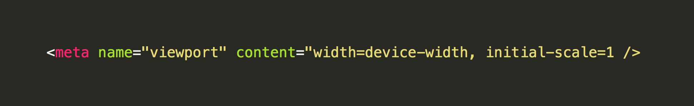
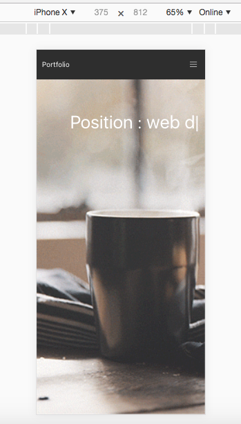
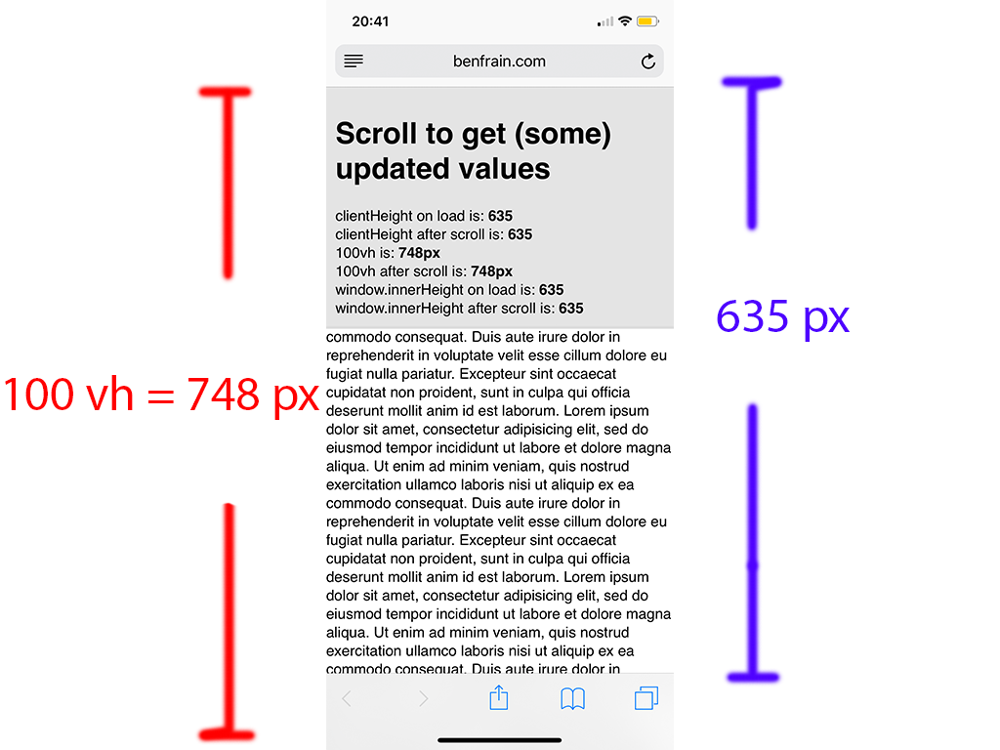
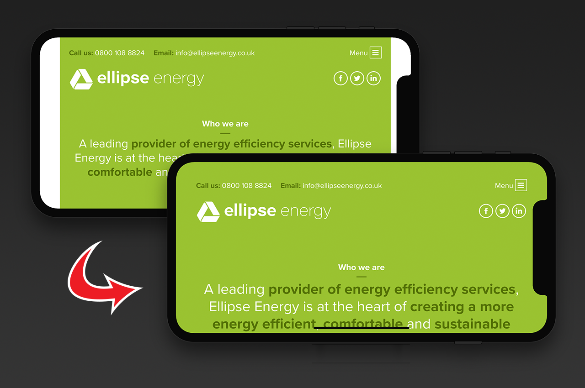

หลายๆคนที่เป็น Front-end Developer คงจะเคยเห็น meta tag viewport อยู่ตามเว็บไซต์ต่างๆ ซึ่งจะมีหน้าตาประมาณนี้

```
<meta name="viewport" content="width=device-width, initial-scale=1 />
```

แล้วแม่งมีอยู่ในทุกๆ website เลย เคยสงสัยมั้ยครับว่า มีไว้ทำอะไร ทำไมถึงต้องใส่มันเอาไว้ด้วยนะ ?

ขอย้อนอดีตกลับไปในยุคก่อนที่จะมี Smartphone เว็บไซต์นั้นได้ถูกออกแบบมาให้ใช้กับหน้าจอของ Computer เพียงอย่างเดียว แต่เมื่อท่านศาสดา Steve Jobs เปิดตัว iPhone ความลำบากของ Developer ก็เพิ่มขึ้นคือ เว็บแม่งต้องเปิดบนหน้าจอของ Smartphone ได้ด้วยนะ แต่เว็บไซต์มันไม่ได้ทำมาเพื่อ Smartphone ไง พอไปเปิดแล้วขนาดของมันก็เล็กเกินไป จะอ่านอะไรก็ต้อง ซูมเข้าไป แล้ว Scroll ซ้าย ขวา ขึ้น ลง โอ้ WTF! ชีวิตแม่งโคตรจะเหนื่อยเลย

ซึ่ง meta tag viewport มาช่วยเราตรงนี้แหละ เย้ !!!

### What is The Viewport?

viewport คือ ส่วนที่เรามองเห็นได้ของหน้าเว็บไซต์นั้นๆ

```
<meta name="viewport" content="width=device-width, initial-scale=1 />
```

จาก code meta tag ข้างบนจะอธิบายได้ว่า

`width=device-width` จะบอกให้ Web Browser กำหนดความกว้างของเว็บไซต์ ให้เท่ากับความกว้างของหน้าจอ ของ device นั้นๆ

`initial-scale=1` จะเป็นการบอกให้ Web Browser กำหนดการซูมของเว็บไซต์

](./asset-2.png)

### What are viewport units?

](./asset-3.png)

`vw`, `vh`, `vmin`, and `vmax` หน่วยเหล่านี้จะแสดงถึงเปอร์เซ็นต์ของ viewport บน Browser นั้นๆ

**Viewport Width** (`vw`) จะบอกถึง เปอร์เซ็นต์ความกว้างทั้งหมดของ viewport เช่น เราบอกว่า หน้าจอเรามีความกว้าง 100px ถ้าเราเราบอกว่า เราต้องการแสดงผลแค่ 10% ของความกว้างหน้าจอ เราสามารถเขียนแทนได้ด้วย 10vw ซึ่งจะมีค่าเท่ากับ 10px

**Viewport Height** (`vh`) จะบอกถึง เปอร์เซ็นต์ความสูงทั้งหมดของ viewport

**Viewport Minimum** (`vmin`) จะบอกถึงเปอร์เซ็นต์ของ _ค่าต่ำสุด_ ของ viewport

**Viewport Maximum** (`vmax`) จะบอกถึงเปอร์เซ็นต์ของ _ค่าสูงสุด_ ของ viewport

จากหน่วยที่เราเรียนรู้มาทั้งหมด เราสามารถสรุปได้ว่า ถ้าเราต้องการทำหน้าเว็บไซต์ ให้มีความสูงเท่ากับความสูง viewport ของ Browser เราจะสามารถกำหนด CSS ได้ดังนี้

```
my-element {
  height: 100vh;
}
```

ซึ่งการแสดงผลจะเห็นว่าหน้าเว็บไซต์มีขนาดเท่ากับขนาดของ Browser (จากรูปข้างบน ผมกำหนดให้ รูปมีขนาด 100vh)

ทีนี้ลองเปลี่ยนเป็นแสดงผลตามขนาดจอ Mobile ใน browser ดู



จะเห็นว่าการแสดงผล ก็ขึ้นอยู่กับเปอร์เซ็นต์ความสูงของ device นั้นๆ ในที่นี้กำหนดให้รูปเท่ากับ 100vh ความสูงเลยเท่ากับ 100% ของ viewport

หากลองเข้าไปดูที่เว็บ [https://caniuse.com](https://caniuse.com/#feat=viewport-units) จะเห็นว่า Browser หลายๆตัว ก็รองรับ Viewport กันหมดแล้ว

](./asset-6.png)

### แต่ Mobile Browser บน Device จริงนั้นช่างเจ็บปวด

จะเห็นว่าแค่เรากำหนด 100vh เข้าไป Browser ก็จะจัดการความสูงตามขนาด viewport ให้เราแล้ว แต่บน Mobile Browser (Safari iOS) 100vh มันจะมี Bar ข้างล่างมาบังอยู่ด้วย



จากรูปข้างบน ความคาดหวังของเรา 100vh มันควรจะมีขนาดเท่ากับ 635 px แต่ความเป็นจริงแล้ว 100vh มันคือ 748 px ใน Safari iOS Browser


จากรูปข้างบน ผมกำหนดให้ element มีความสูง 100vh ซึ่งในความเป็นจริง มันไม่ควรจะ scroll ได้ แต่เนื่องจาก Safari iOS Browser มีการคำนวณค่า 100vh โดยที่มันไม่ได้นับว่า Bar ข้างล่างนั้นเป็นส่วนหนึ่งของ Browser Interface ทำให้หน้าเว็บเราสามารถ scroll ได้

### ในความมืดมิดยังคงมีแสงสว่างอยู่เสมอ

เราสามารถใช้ javascript และ css ช่วยคำนวณหา 100vh ที่ควรจะเป็นได้นะ โดยให้เราเพิ่ม css ดังนี้

```
.my-element {
  height: 100vh;
  height: calc(var(--vh, 1vh) * 100);
}
```

จากโค้ดอธิบายได้ว่า เรากำหนด element ให้มีความสูง 100vh เอาไว้เพื่อให้ Browser เก่าๆ ที่ไม่รองรับตัวแปร var() ของ css ใช้งานตัวข้างบน สำหรับ Browser ที่รองรับก็มาอ่านตัวข้างล่าง โดยตัวข้างล่าง จะมีการใช้ ฟังก์ชัน calc() ของ css เพื่อคำนวณหาความสูง โดยจะเอาตัวแปร — vh มาคูณกับ 100 หรือ กรณี — vh ไม่มีค่า ให้ใช้ 1vh คูณกับ 100 แทน

จากนั้นเราก็เพิ่ม javascript ที่ใช้คำนวณหาความสูงของ viewport ดังนี้

```
let vh = window.innerHeight * 0.01;
document.documentElement.style.setProperty('--vh', `${vh}px`);
```

โดย javascript ข้างบน จะเป็นการบอกให้ไปเซ็ตตัวแปรชื่อ — vh ไว้ที่ root element ให้มีค่าเท่ากับ window.innerHeight \* 0.01 และมีหน่วยเป็น px เมื่อเราได้ค่า — vh มาแล้ว มันจะไปแทนที่ตัวแปรในฟังก์ชัน var() ที่เราประกาศไว้ตั้งแต่ตอนแรก สุดท้ายเราก็จะได้ค่า viewport ที่เป็นส่วนในการแสดงผลจริงๆของ Browser นั้น

สามารถเปรียบเทียบผลลัพธ์กันได้จากภาพข้างล่าง

-   อันซ้ายจะเป็น 100vh ธรรมดา (จะเห็นว่ามัน scroll ได้)
-   อันขวาจะเป็น 100vh ที่มาจากคำนวณของ javascript


ใครอยากเอาไปลองเปิดเองบน Mobile Browser ก็ได้นะ ตามลิ้งนี้เลย

[**React App**  
_Edit description_test-100vh.surge.sh](http://test-100vh.surge.sh/ "http://test-100vh.surge.sh/")[](http://test-100vh.surge.sh/)

[**React App**  
_Edit description_test-100vh-fix.surge.sh](http://test-100vh-fix.surge.sh/ "http://test-100vh-fix.surge.sh/")[](http://test-100vh-fix.surge.sh/)

ในส่วนของ Browser บน Android ยังไม่เคยลองแหะ ใครว่างๆ ฝากลองหน่อยนะฮับว่า 100vh มันสามารถ scroll ได้มั้ย เท่าที่ลองตอนนี้เป็นแค่ใน iOS นะ ฮ่าๆ

### Source Code

[**rainstormza/react-100vh**  
_Contribute to rainstormza/react-100vh development by creating an account on GitHub._github.com](https://github.com/rainstormza/react-100vh "https://github.com/rainstormza/react-100vh")[](https://github.com/rainstormza/react-100vh)

### ของแถม

สำหรับใครที่อยากลองเล่นเกี่ยวกับ meta tag viewport เพิ่มเติม ก็จะมี viewport-fit=cover เอาไว้ใช้สำหรับ มือถือที่มี safe-area

```
<meta name="viewport" content="width=device-width, initial-scale=1.0, viewport-fit=cover">
```

[**CSS Environment variables; how to deal with the software bezel of iPhone X**  
_Like many a web developer, I’ve found myself tweaking things of late for the iPhone X. Personally, I don’t see the…_benfrain.com](https://benfrain.com/css-environment-variables-iphonex/ "https://benfrain.com/css-environment-variables-iphonex/")[](https://benfrain.com/css-environment-variables-iphonex/)

[**Removing the White Bars in Safari on iPhone X**  
_The new iPhone X features a beautiful edge-to-edge display. Well, almost. There is the small issue of a notch at the…_stephenradford.me](https://stephenradford.me/removing-the-white-bars-in-safari-on-iphone-x/ "https://stephenradford.me/removing-the-white-bars-in-safari-on-iphone-x/")[](https://stephenradford.me/removing-the-white-bars-in-safari-on-iphone-x/)

[**Designing Websites for iPhone X**  
_The section below about safe area insets was updated on Oct 31, 2017 to reflect changes in the iOS 11.2 beta. Out of…_webkit.org](https://webkit.org/blog/7929/designing-websites-for-iphone-x/ "https://webkit.org/blog/7929/designing-websites-for-iphone-x/")[](https://webkit.org/blog/7929/designing-websites-for-iphone-x/)

[**Take your web development skills a notch higher**  
_Raise your hands if you love the notch on iPhone X, XS, XR or XS Max! 🙋🏻‍♀️🙋‍♂️ Okay, not many hands went up there…_dev.to](https://dev.to/marvindanig/take-your-web-development-skills-a-notch-higher-2cge "https://dev.to/marvindanig/take-your-web-development-skills-a-notch-higher-2cge")[](https://dev.to/marvindanig/take-your-web-development-skills-a-notch-higher-2cge)

### References

[**CSS Unit 7 ตัวที่คุณไม่น่าจะรู้มาก่อน**  
_มันง่ายมากที่จะเกิดอาการตันเมื่อทำงานเกี่ยวกับ CSS ด้วยเทคนิคต่างๆ ที่เราคุ้นเคยเป็นอย่างดี…_webdesign.tutsplus.com](https://webdesign.tutsplus.com/th/articles/7-css-units-you-might-not-know-about--cms-22573 "https://webdesign.tutsplus.com/th/articles/7-css-units-you-might-not-know-about--cms-22573")[](https://webdesign.tutsplus.com/th/articles/7-css-units-you-might-not-know-about--cms-22573)

[**Viewport Meta Tag คืออะไร ? + สอนวิธีใช้**  
_สำหรับใครที่ทำ responsive web อยู่ คงจะคุ้นเคยกับ viewport meta tag เป็นอย่างดี แต่หลายๆ คนอาจจะต้องแปลกใจ…_www.siamhtml.com](http://www.siamhtml.com/html-viewport-meta-tag/ "http://www.siamhtml.com/html-viewport-meta-tag/")[](http://www.siamhtml.com/html-viewport-meta-tag/)

[**Fun with Viewport Units | CSS-Tricks**  
_Viewport units have been around for several years now, with near-perfect support in the major browsers, but I keep…_css-tricks.com](https://css-tricks.com/fun-viewport-units/ "https://css-tricks.com/fun-viewport-units/")[](https://css-tricks.com/fun-viewport-units/)

[**The iOS Safari menu bar is hostile to web apps: discuss**  
_I’m a big fan of Safari in general. My loathing of Safari on iOS is largely restricted to the menu bar. For clarity…_benfrain.com](https://benfrain.com/the-ios-safari-menu-bar-is-hostile-to-web-apps-discuss/ "https://benfrain.com/the-ios-safari-menu-bar-is-hostile-to-web-apps-discuss/")[](https://benfrain.com/the-ios-safari-menu-bar-is-hostile-to-web-apps-discuss/)

[**Test the viewport size**  
_Lorem ipsum dolor sit amet, consectetur adipisicing elit, sed do eiusmod tempor incididunt ut labore et dolore magna…_benfrain.com](http://benfrain.com/playground/viewport-test.html "http://benfrain.com/playground/viewport-test.html")[](http://benfrain.com/playground/viewport-test.html)

[**The trick to viewport units on mobile | CSS-Tricks**  
_Viewport units have always been controversial and some of that is because of how mobile browsers have made things more…_css-tricks.com](https://css-tricks.com/the-trick-to-viewport-units-on-mobile/ "https://css-tricks.com/the-trick-to-viewport-units-on-mobile/")[](https://css-tricks.com/the-trick-to-viewport-units-on-mobile/)

[**tylerjpeterson/ios-inner-height**  
_Retrieve a consistent, accurate \`window.innerHeight\` measurement from iOS — tylerjpeterson/ios-inner-height_github.com](https://github.com/tylerjpeterson/ios-inner-height "https://github.com/tylerjpeterson/ios-inner-height")[](https://github.com/tylerjpeterson/ios-inner-height)
