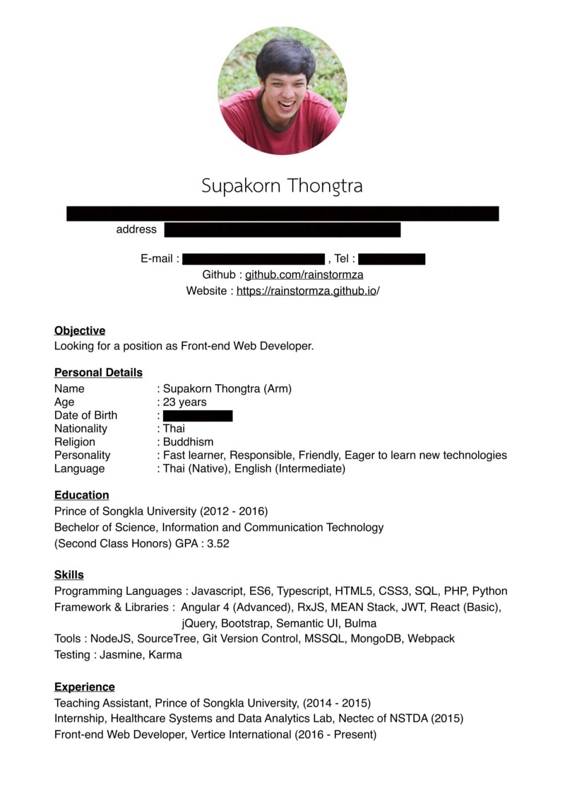
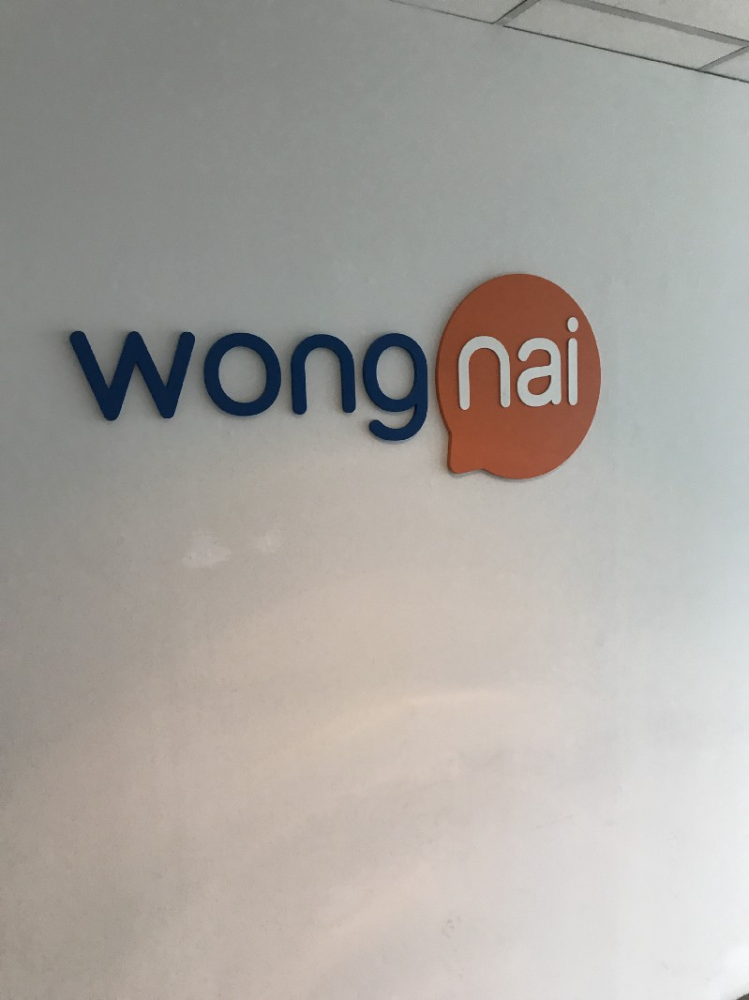
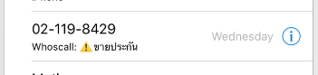
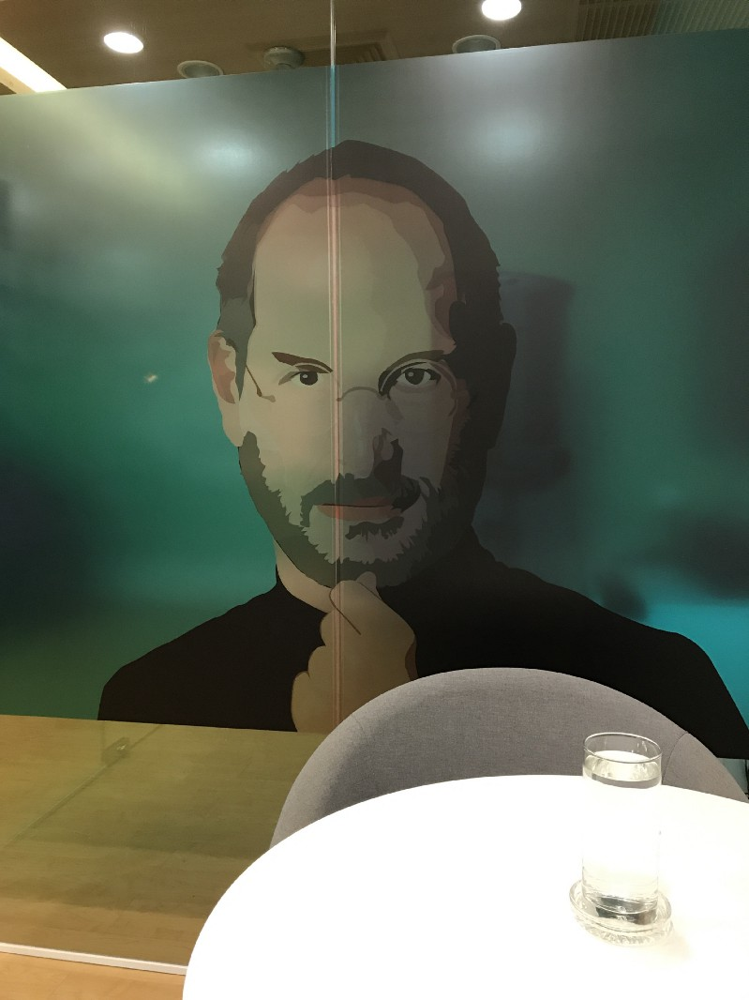
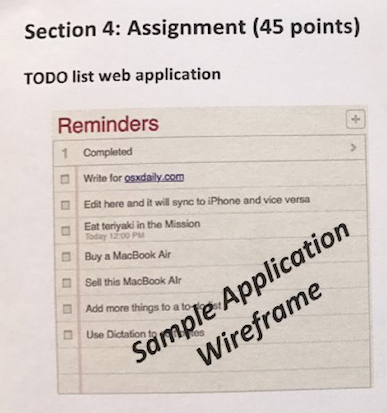

](./asset-1.png)

ทุกวันนี้ต้องบอกเลยว่าโปรแกรมเมอร์ส่วนใหญ่ที่จบออกมาแล้วสามารถทำงานได้จริงมีจำนวนน้อยมาก บางคนเรียนให้จบๆไปแล้วกลับไปทำธุรกิจที่บ้านบ้าง บางคนไปเรียนต่อบ้าง บางคนเรียนจบแล้วไม่อยากทำงานสายนี้เลยก็มี

ส่วนบางคนที่เรียนดี เขียนโปรแกรมเก่ง แต่สมัครงานที่ไหนก็ไม่โดนเรียนสัมภาษณ์เพราะ resume ไม่เข้าตากรรมการ หรือ บางคนโดนเรียกสัมภาษณ์แล้ว วันจริงตอนที่ไปสัมภาษณ์ตอบคำถามไม่ถูกใจกรรมการก็มี

[**โปรแกรมเมอร์ขาดตลาด 1,000,000 คนไทยแลนด์ 4.0 สะดุด**  
_เว็บไซต์ข่าวเศรษฐกิจ เพื่อนักธุรกิจรุ่นใหม่ ผนวกไลฟ์สไตล์ Start up SMEs อสังหา การเงิน การลงทุน การตลาด เทคโนโลยี_www.thansettakij.com](http://www.thansettakij.com/content/133452 "http://www.thansettakij.com/content/133452")

[**วิกฤต “โปรแกรมเมอร์” มหากาพย์ “ไทยแลนด์ 4.0”**  
_สัมภาษณ์_www.prachachat.net](http://www.prachachat.net/news_detail.php?newsid=1497697504 "http://www.prachachat.net/news_detail.php?newsid=1497697504")

เนื่องจากเหตุผลข้างต้น จึงอยากแชร์ประสบการณ์ในการสัมภาษณ์งานที่มีโอกาสได้ไปมา ไว้เป็นแนวทางในการเตรียมตัวสำหรับเด็กที่จบใหม่หรือคนที่กำลังหางานอยู่ เพื่อให้มีความพร้อม ความมั่นใจ สำหรับการหางานในสายงานโปรแกรมเมอร์

---

### เริ่มแรกก่อนเลย คือ ก่อนที่เราจะไปสมัครงาน เราจำเป็นต้องเตรียมอะไรบ้าง ?

#### Resume (resume ดีมีชัยไปกว่าครึ่ง)

สิ่งแรกที่ HR จะเห็นเกี่ยวกับตัวคุณก็คือ resume ดังนั้นควรจะทำให้มันออกมาเรียบง่าย อ่านแล้วเข้าใจง่าย ข้อมูลที่ใส่ใน resume ควรจะเป็นสิ่งที่เป็น**ความจริง**เกี่ยวกับตัวคุณและเขียนสิ่งที่คุณทำได้ สิ่งที่คุณถนัดลงไป ( สำหรับคนที่ยังทำ resume เป็นภาษาไทยอยู่ แนะนำว่าให้เปลี่ยนเป็นภาษาอังกฤษจะดีกว่า ถึงแม้คุณจะไม่ได้เก่งภาษาอังกฤษ แต่หากมีคุณความพยายามในการทำ resume เป็นภาษาอังกฤษ ผมมองว่าสิ่งที่บริษัทที่คุณส่ง resume ไป จะมองเห็นก็คือความพยายามของคุณ )

#### Github (ไม่มีถือว่าบาปมากนะ มีเหอะอยากให้มี)

ในสายงานโปรแกรมเมอร์ ไม่ว่าคุณจะเขียนภาษาอะไร คุณจะทำ iOS, Andorid หรือ Website คุณควรจะมีสถานที่เอาไว้เก็บผลงานของคุณเอง ไม่ว่าจะเป็นผลงานที่เขียนขึ้นเอง หรือ ไปดูตัวอย่างที่อื่นแล้วมาทำตาม หรือ ผลงานที่ไปเรียนมากจาก youtube คุณควรจะ push สิ่งที่คุณเคยเขียนด้วยตัวเองขึ้นไปบน github ในกรณีที่ Dev Team อยากรู้ข้อมูลเกี่ยวกับผลงานของคุณ เค้าก็สามารถดู github ของคุณได้ ว่ามีผลงานอะไรบ้าง การเขียนโค้ดของคุณเป็นอย่างไร ( ประโยชน์อีกอย่างคือ เค้าจะรู้ได้ว่าคุณใช้ git เป็นในระดับนึง )

[**Build software better, together**  
_GitHub is where people build software. More than 22 million people use GitHub to discover, fork, and contribute to over…_github.com](https://github.com/ "https://github.com/")

---

### อันดับต่อมา สิ่งที่คุณจำเป็นต้องรู้อีกอย่างก็คือ คุณจะหางานได้จากที่ไหนบ้าง ?

-   **group facebook**

มี HRโพสหาคนทำงานในกลุ่มเฟชบุ๊คแทบจะทุกวัน

[https://www.facebook.com/groups/647718825333067/](https://www.facebook.com/groups/647718825333067/)

-   **blognone job**

นอกจากติดตามข่าวสาร IT แล้ว ยังเป็นที่ประกาศหางานของบริษัทดังๆ มากมาย

[**Blognone Jobs | Blognone**  
_InvestorZ.com รับสมัครเหล่าทวยเทพ iOS/Android/Web Developer วิสัยทัศน์ไกล เพียง1ก้าวจาก BTS ศาลาแดงเงินเดือนสูง 150K ห…_www.blognone.com](https://www.blognone.com/forums/blognone-jobs "https://www.blognone.com/forums/blognone-jobs")

-   **jobdbs**

เป็นอีกเว็บนึงที่ใช้หางานได้ โดยแค่ไปสมัครสมาชิก แล้วฝากข้อมูลที่จำเป็นเอาไว้ ถ้า profile เราไปตรงกับสิ่งที่บริษัทต่างๆ กำลังหาคนอยู่ jobdbs ติดต่อกลับหาเราให้เองเลยนะ

[**Job search, job opportunities & career development | jobsDB Thailand**  
_jobsDB is the largest Recruitment Network across Asia Pacific — Australia, China, Hong Kong, India, Indonesia, Korea…_th.jobsdb.com](http://th.jobsdb.com/th/th "http://th.jobsdb.com/th/th")

-   github

สำหรับคนอยากทำงานที่ต่างประเทศ github job จะมีบริษัททั่วโลกที่กำลังหาคนอยู่ เค้าก็เอามาฝากไว้ในนี้แหละ

[**GitHub Jobs**  
_Edit description_jobs.github.com](https://jobs.github.com/ "https://jobs.github.com/")

-   stack overflow

นอกจากเป็นเว็บไซต์ที่ช่วยเหลือ Dev ในการหาข้อมูลเกี่ยวกับบัคต่างๆ แล้วยังเป็นเว็บไซต์ที่ใช้ช่วย Dev หางานอีกด้วย มีทั้งบริษัทในประเทศและต่างประเทศเลย

[**Stack Overflow Jobs**  
_Want to work remotely? Find Ruby jobs? Your job recommendations are customized to your needs. Salary, tech stack, and…_stackoverflow.com](https://stackoverflow.com/jobs "https://stackoverflow.com/jobs")

#### หลังจากที่เรามี resume และ แหล่งหางานแล้ว เราก็สามารถ resume ไปที่บริษัทต่างๆ ที่เราอยากจะเข้าได้ ถ้า resume ของคุณเข้าตา HR หรือ Dev Team คุณก็จะได้รับโทรศัพท์ นัดวันให้ไปสัมภาษณ์ เอ้า เฮ !!!

---

### ต่อจากนี้จะขอแชร์ประสบการณ์ส่วนตัวในการสัมภาษณ์งานกับบริษัทต่างๆ ที่ผมได้ส่ง resume ไป โดยมีทั้งหมด 3 บริษัท ดังนี้

#### บริษัทที่ 1

[**รีวิวร้านอาหาร ร้านเสริมสวยและสปา ในกรุงเทพและปริมณฑล แนะนำโดยลูกค้าจริง — Wongnai on wongnai.com**  
_รีวิวร้านอาหาร ร้านเสริมสวยและสปา ค้นหาข้อมูลร้าน รูปภาพ ที่อยู่ เบอร์โทรศัพท์ ส่วนลด ดีล บทความแนะนำร้านเด็ด ในกรุงเท…_www.wongnai.com](https://www.wongnai.com/ "https://www.wongnai.com/")

[**ประสบการณ์ทำงานที่ Wongnai**  
_คำเตือน: ผมเป็น Developer ที่ Wongnai อย่างไรก็ตาม ผมจะพยายามนำเสนอข้อมูลที่ตรงที่สุดครับ เพื่อให้ทุกคนได้ประโยชน์ครับ_medium.com](https://medium.com/@tanapoln/%E0%B8%9B%E0%B8%A3%E0%B8%B0%E0%B8%AA%E0%B8%9A%E0%B8%81%E0%B8%B2%E0%B8%A3%E0%B8%93%E0%B9%8C%E0%B8%97%E0%B8%B3%E0%B8%87%E0%B8%B2%E0%B8%99%E0%B8%97%E0%B8%B5%E0%B9%88-wongnai-28e897526629 "https://medium.com/@tanapoln/%E0%B8%9B%E0%B8%A3%E0%B8%B0%E0%B8%AA%E0%B8%9A%E0%B8%81%E0%B8%B2%E0%B8%A3%E0%B8%93%E0%B9%8C%E0%B8%97%E0%B8%B3%E0%B8%87%E0%B8%B2%E0%B8%99%E0%B8%97%E0%B8%B5%E0%B9%88-wongnai-28e897526629")

วงในเป็นบริษัทที่คนไอทีในประเทศไทยส่วนใหญ่อยากเข้าไปทำงาน (เคยอ่านเจอว่าติด 1 ใน 5 บริษัทที่คนไทยอยากเข้ามากที่สุดเลยนะเออ) ไม่ว่าจะเป็นเพราะเรื่องของสวัสดิการ สังคมการทำงาน ทำงานที่บ้านได้ วันหยุดเยอะแยะ อีกอย่างคือถ้าได้เข้าทำงานกับวงใน เค้ามี macbook ให้ใช้ด้วยนะ (ใครไม่อยากเข้าบ้างละทีนี้)

wongnai เป็นบริษัทแรก ที่ผมส่ง resume ไป แต่เป็นบริษัทสุดท้ายที่เรียกสัมภาษณ์ (ตอนแรกคิดว่าจะไม่โดนเรียกแล้วซะอีก) สมัครในตำแหน่ง Front-end Developer บริษัทอยู่แถวๆ bts ทองหล่อ เดินต่อจาก bts ไกลพอสมควร (750 เมตร) พอไปถึง HR ก็ให้ทำข้อสอบ มีเวลาให้ทำประมาณ 1 ชั่วโมง 30 นาที โดยข้อสอบ จะแบ่งเป็น 3 part ดังนี้ ทดสอบ logic ทั่วไป, ทดสอบ javascript + ReactJS, ทดสอบ IQ โดยข้อสอบเป็นภาษาไทยทั้งหมด (ข้อสอบยากมากๆ)

Part 1 ทดสอบ logic ทั่วไป (จริงๆ มันก็ไม่ทั่วไปหรอก ยากพอสมควรเลย T^T)

-   recursive function
-   ให้ function ซ้อนกันเยอะๆ มา ให้หาค่า a,b,c
-   เขียน function handle input ที่เข้ามา (คิดอะไรไม่ออก x % 2 == 0 ไว้ก่อนเลย 555+)
-   หลักการของ OOP encapsulation, inheritance, polymorphism, overriding, overloading
-   design pattern
-   Big O Notation (อันนี้ในหัวโคตรว่างเปล่าเลย)

Part 2 ทดสอบ Javascript และ ReactJS (ยากครับแต่ไม่เท่า Part 1)

-   ในส่วน Javascript นี้ ต้องบอกว่ามันไม่ใช่หลักการ Javascript ที่มีสอนทั่วๆไป มันเป็นหลักการเชิงลึกของ Javascript เลย แนะนำให้ไปเรียนคอร์สนี้ [https://www.udemy.com/understand-javascript/](https://www.udemy.com/understand-javascript/) และอ่านเพิ่มเติม เกี่ยวกับ .call() .bind() [https://www.babelcoder.com/blog/posts/javascript-bind-apply-call](https://www.babelcoder.com/blog/posts/javascript-bind-apply-call) , event loop, scope น่าจะทำได้ไม่ยาก
-   ในส่วนของ ReactJS เกี่ยวกับ life cycle, redux, immutable object vs mutable object, high-order Function
-   functional programming อ่านบนความพวกนี้ได้เลย [https://medium.com/funk-tional/hello-functional-programming-eacb0091a53c](https://medium.com/funk-tional/hello-functional-programming-eacb0091a53c) , [https://www.babelcoder.com/blog/posts/introduction-to-functional-programming-in-javascript](https://www.babelcoder.com/blog/posts/introduction-to-functional-programming-in-javascript)

Part 3 ทดสอบ IQ

-   มีโจทย์ 39 ข้อ พวกสัญลักษณ์ต่างๆ ตอนทำไป 20 ข้อแรกจะรู้สึกว่าตัวเองฉลาดมาก แต่ พอถึง 19 ข้อหลังนี้ ยอมรับว่าผมเข้าไม่ถึงจริงๆ เออกุโง่ก็ได้ สรุปก็ได้คะแนน IQ = 107 ยังถือว่าพอมีความรู้อยู่บ้าง 55+

ข้อสอบทั้งหมดจริงๆ ไม่ได้มีแค่นี้ มันยังมีรายละเอียดย่อยๆ อีกพอสมควรแต่ผมจำไม่ได้ละ ความรู้สึกหลังทำข้อสอบเสร็จ คือ สูญเสียความมั่นใจในการเขียนโค้ดไปพอสมควร ยากจริงอะไรจริง หลังจากทำข้อสอบอันแสนโหดร้ายเสร็จแล้ว สรุปว่าได้เข้าสัมภาษณ์ต่อ (ถ้าทำข้อสอบไม่ผ่านเกณฑ์ ไม่มีสิทธิ์สัมภาษณ์นะเออ) คนสัมภาษณ์คือ พี่บอย CTO ของ wongnai ก่อนจะเริ่มสัมภาษณ์ ก็มีเอาข้อสอบที่เราทำไปมาให้ดู แล้วบอกว่าข้อนี้ผิดอยู่ลองแก้ดู นั่งคิดไปสักพักพอบอกคำตอบไป แก้กรณีนี้ได้แล้ว เค้ายกตัวอย่างมีอีกกรณี เงิบเลยครับ ยังผิดอยู่ คิดไปสักพัก คิดไม่ออก เลยบอกไปว่า คิดไม่ออกแล้วครับ 555+ (ช็อตนี้ บั่นทอนกำลังใจอย่างมาก) หลังจากจบเรื่องข้อสอบไปพี่เค้าก็เริ่มถาม ถามตั้งแต่ ตอนอยู่มหาลัยจนถึงที่ทำงานปัจจุบันผ่านอะไรมาบ้าง, อนาคตอีก 5 ปีข้างหน้าตั้งเป้าหมายไว้ยังไง , angular react ต่างกันยังไง, bulma กับ semantic ui ต่างกันยังไง, ข้อมูลเทคนิคจัดหนักจัดเต็มมากครับ (แน่นอนละ CTO มาเอง) ตอบได้บ้าง ไม่ได้บ้าง ส่วนใหญ่จะตอบไปแบบมั่วๆ เพราะในหัวตอนนั้นว่างเปล่ามากๆ เอาเป็นว่าคร่าวๆประมาณนี้ สรุปใช้เวลาตั้งแต่ 9.30–12.30 สัมภาษณ์นานสุดในชีวิตเลยครับ ใช้สมองเยอะสุดๆ และพี่เค้าบอกจะบอกผลภายใน 1 อาทิตย์

หลังจากสัมภาษณ์เสร็จ ความรู้สึกว่าไม่ได้เข้าทำงานที่นี่แน่นอนมาเต็มมากๆครับ แต่ในใจก็แอบหวังเล็กๆ และแล้วไม่นาน สวรรค์มีตาฟ้ามีใจ ก็มีโทรศัพท์เข้ามา 02–119-xxxx เห็นเบอร์ขึ้นต้นด้วย 02 เอาวะ โทรมาจากวงในแน่ๆ (เข้าข้างตัวเองแบบสุดๆ) พอรับสาย HR ก็เริ่มอธิบาย

> ถ้าคุณสมัคร package ประกันนี้กับเราคุณจะได้อย่างนี้ บลา ๆ ๆ ๆ

(WTF อะไรกันวะนั่น) สรุปคือ คนขายประกันโทรมาครับ เจ็บปวดหัวใจมากๆ หลังจากนั้นผมเลยไปโหลด app whoscall มาใช้เลยครับ

[**Whoscall — Search Phone Number**  
_Whoscall provides over 700 million global phone numbers, you can find the unknown phone number information and filter…_whoscall.com](https://whoscall.com/en-US/ "https://whoscall.com/en-US/")

จะได้ไม่ต้องรับสายอะไรพวกนี้อีก T^T

---

#### Nextzy

[**Nextzy Technologies Co.,ltd. รับสมัครผู้ร่วมทีมจำนวนมาก จบใหม่และมีประสบการณ์ Mobile และ Web …**  
_Nextzy Technologies Co.,ltd. รับสมัครทีม iOS, Android, Java Web, MEAN Stack และ System Analyst พวกเราคือโจรสลัดแห่งวงก…_www.blognone.com](https://www.blognone.com/node/64996 "https://www.blognone.com/node/64996")

[**ชีวิตการทำงานที่ Nextzy**  
_เรื่องราวของ MEAN Stack Dev คนหนึ่งในทีม Nextzy_blog.nextzy.me](https://blog.nextzy.me/my-life-at-nextzy-1532aa6af0f5 "https://blog.nextzy.me/my-life-at-nextzy-1532aa6af0f5")

บริษัท Nextzy เป็นบริษัทที่มีแต่โจรสลัด แต่เป็นโจรสลัดที่พร้อมจะออกล่างาน Web and Mobile Development ที่นี่ใครเป็น Dev ได้ macbook ใช้เหมือนกันนะ นอกจากนั้น ยังมีเครื่องเล่นเกมส์มากมายเอาไว้ให้เล่นอีกด้วย

Nextzy เป็นบริษัทที่ 2 ที่ผมส่ง resume ไป และเป็นบริษัทแรกที่โทรมาเรียกไปสัมภาษณ์ (ใช้เวลาประมาณ 1 วันในการตอบกลับ) สมัครเข้าไปในตำแหน่ง MEAN Stack Developer บริษัทนี้อยู่แถวๆ mrt เพชรบุรี วันที่ไปสัมภาษณ์ ตอนไปถึงที่บริษัท HR ก็ให้ผมไปนั่งรอในห้องที่มีท่านศาสดาที่ผมเคารพนับถือมาก

หลังจากนั่งรอไม่นาน ทางบริษัทก็มีข้อสอบมาให้ทำ เป็นข้อสอบทดสอบ logic และ ทดสอบภาษอังกฤษ ต้องบอกว่าข้อสอบ logic ไม่ได้ยากมากนักเป็นพวก if else logic และ มีคำนวณนิดหน่อย แต่ !!! ข้อสอบทดสอบภาษาอังกฤษค่อนข้างยากเลย มีทั้ง คำศัพท์ที่ยากๆ, ให้หา Error Detection, Short Essay บลาๆ ๆ (ในใจคิดว่าตัวเองกำลังสอบ TOEFL อยู่รึป่าววะเนี่ย 55+)

หลังจากทำข้อสอบเสร็จแล้ว ก็มี Dev Team เข้ามาสัมภาษณ์ 2 คน เค้าให้เราขายตัวเองภายใน 3 นาที ให้เค้าฟัง จากนั้นเค้าก็ถามคำถามเกี่ยวกับเทคนิคนิดหน่อย และขอดูผลงานที่เราเคยทำมา และ เข้าไปดู github ของผม (github เริ่มมีประโยชน์แล้วเห็นมั้ย :) ) ว่าผมเขียนโค้ดเป็นอย่างไรบ้าง แต่โดยรวมจริงๆแล้ว เป็นผมเองซะมากกว่าที่เป็นฝ่ายถามคนสัมภาษณ์ ฮ่าๆ พอสัมภาษณ์เสร็จเค้าก็บอกว่า จะติดต่อกลับไปภายใน 2 วัน

ตอนกลางคืนของวันที่ไปสัมภาษณ์ขณะที่ผมกำลังเล่น PES 2017 ก็มีเบอร์แปลกโทรมาบอก คร่าวๆประมาณว่า

> นี้พี่นิวนะ CEO บริษัท Nextzy น้องผ่านสัมภาษณ์แล้ว

โอ้โห รออะไรละ เฮสิครับ !! บอกผลรวดเร็วทันใจดีมาก แถมยังเป็น CEO โทรมาหาเองอีกด้วย ดีใจครับ ความรู้สึกเหมือนเค้าเห็นคุณค่าในตัวเรา คุยโทรศัพท์กันนานพอสมควร หลังจากนั้นผมบอกไปว่า ผมยังไม่ขอตัดสินใจนะ เพราะมีอีกบริษัทเรียกไปสัมภาษณ์เหมือนกัน พี่เค้าก็เข้าใจเราแหละ เค้าบอกเค้าเคยเป็นโปรแกรมเมอร์มาก่อน ผมก็โอเค ยังไงเดี๋ยวผมโทรกลับไปคอนเฟิร์มนะครับ

---

#### scale360

[**Scale360 >>> หาเพื่อนร่วมทีมตำแหน่ง\*\*Front-end Web Developer\*\* | Blognone**  
_At Scale 360, you will be: \* Develop new UI features for web and mobile application \* Develop and optimize a complex…_www.blognone.com](https://www.blognone.com/node/92456 "https://www.blognone.com/node/92456")

[**Home Page | Dotography**  
_The components that we use to build our software include award winning UX/UI design, ReactJS & Scala based code, real…_www.dotography.com](http://www.dotography.com/ "http://www.dotography.com/")

scale360 เป็นบริษัทสัญชาติอังกฤษทำเกี่ยวกับ digital banking ( FinTech Start-up) ซึ่งเค้ารับคนเยอะมากๆ ตอนนี้เค้าบอกว่ามีประมาณ 80–100 คน ภายในสิ้นปีจะเอาให้ถึง 200 คน เลยทีเดียว

scale360 เป็นบริษัทที่ 3 ที่ผมส่ง resume ไป เป็นบริษัทที่ 2 ที่โทรมาเรียกไปสัมภาษณ์ (ใช้เวลาประมาณ 1–2 ชั่วโมงในการตอบกลับ) สมัครเข้าไปในตำแหน่ง Front-end Developer บริษัทนี้อยู่แถวๆ mrt สุขุมวิท (ไกลพอสมควรถ้าเดินจากไป)

พอมาถึงบริษัท HR ก็พาผมไปนั่งพร้อมกับให้ทำข้อสอบ ข้อสอบเกี่ยวกับ html css และ พวก logic ต่างๆ มีให้เขียนฟังก์ชัน หา factorial, หา หรม, หา Palindrome String โดยข้อสอบทั้งหมดเป็นข้อเขียนและเป็นภาษาอังกฤษ

หลังจากทำข้อสอบเสร็จก็มีพี่คนนึงเข้าสัมภาษณ์ ให้เราแนะนำตัวเอง และบอกคร่าวๆ เกี่ยวกับ เทคโนโลยีที่เราเคยทำมา หลังจากแนะนำตัวเสร็จพี่เค้าก็มีคำถามทดสอบ logic นิดหน่อย แล้วก็มี project ง่ายๆ ให้ไปทำมาซึ่งก็คือ web app todo list

หลังจากเห็น project แล้วคิดว่าไม่น่าจะเกินความสามารถ แต่ !!! ที่บริษัทใช้ ReactJS พี่เค้าเลยบอกให้ใช้ react เขียนมานะ (ในใจคิดว่าเริ่มยากแล้วละ ความรู้แทบจะเป็นศูนย์เกี่ยวกับ react ที่ผ่านมาเขียนแต่ angular) พี่เค้าบอกว่าอยากรู้ว่าถ้าเริ่มจากศูนย์จะสามารถทำได้แค่ไหน พี่เค้าบอกอีกอย่างว่าตอนส่งให้ใส่ github มา (github มีประโยชน์อีกแล้ว) พร้อมกับ deploy ตัว project ลงที่ไหนก็ได้ สุดท้ายก็รับ project มาทำและเขียนจนเสร็จ ใช้เวลาประมาณ 2–3 วัน

[**React App**  
_Edit description_rainstormza.github.io](https://rainstormza.github.io/todolist/ "https://rainstormza.github.io/todolist/")

ประมาณ 1–2 วันหลังจากที่ส่ง project ไปให้ตรวจก็มี HR โทรมาบอกว่า

> ทำข้อสอบผ่านและผ่านสัมภาษณ์แล้วนะ

เอ้า เฮ อีกรอบ !! ตอนคุยโทรศัพท์ HR ก็ได้อธิบายเกี่ยวกับบรรยกาศบริษัทสวัสดิการต่างๆ เงินเดือน การทำงาน HR (ชื่อพี่เจน) พี่เค้าใจดีมากๆ ตอนเค้าพูดกับผมรู้สึกได้ว่าอยากได้ตัวเราไปทำงานกับเค้าจริงๆ ส่วนเงินเดือนที่ให้ก็ถือว่าสูงกว่าที่อื่นพอสมควรเลย พี่เค้าบอกว่าต้องการคำตอบวันนี้เลย มาเหอะ มาทำงานด้วยกันน้องอย่าใจร้ายกับพี่เลย T^T แต่เนื่องด้วยผมอยากมีเวลาคิด มีเวลาตัดสินใจก่อน ผมจึงบอกไปว่า เดี๋ยวยังไงผมค่อยโทรไปให้คำตอบนะครับ

---

### สรุปประสบการณ์สัมภาษณ์งานที่ผ่านมา

-   Nextzy — ผ่าน
-   scale360 — ผ่าน
-   wongnai — ไม่ผ่าน

สำหรับการสัมภาษณ์ ผมมองว่า ถ้าคุณมีความรู้ความสามารถ เตรียมตัวมาเป็นอย่างดี มีความมั่นใจในการตอบคำถาม แสดงศักยภาพของคุณออกมา ให้คนสัมภาษณ์ได้เห็น ผมคิดว่าคุณจะมีโอกาสที่จะผ่านการสัมภาษณ์สูงมาก ในทางกลับกัน ถ้าโดนถามแล้วตอบอย่างไม่มั่นใจ เตรียมตัวมาไม่ดีพอ ผมลัพธ์ที่ออกมาก็จะไม่ดีไปด้วย

**สุดท้าย** ต้องขอขอบคุณทั้ง 3 บริษัท ที่ให้ผมได้มีโอกาสไปสัมภาษณ์งาน และได้ลองทำข้อสอบ นับว่าเป็นประสบการณ์ที่ดีเยี่ยมมากๆครับ ขอบคุณครับ :)

---

ปล. บทความนี้เป็นบทความแรกที่เขียน ผิดพลาดประการใด ขออภัยด้วยครับ

ปล2. มีคนแนะนำให้เอาข้อสอบออก ดังนั้นผมได้เอาข้อสอบบางข้อที่มันดูเจาะจงเกินไปออก ขอบคุณสำหรับคำแนะนำครับ

